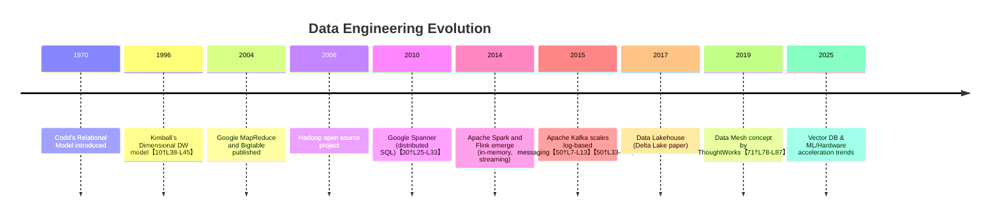

# Ultimate Data Engineering Mastery Guide

## Executive Summary  
This comprehensive guide covers the full spectrum of **data engineering** from fundamentals to cutting-edge innovations. It lays out a structured learning path: starting with **data modeling** and **storage fundamentals**, then exploring **databases (OLTP, OLAP, HTAP, NoSQL/NewSQL)**, **processing engines** (batch/stream), and **pipeline orchestration**. It delves deep into **distributed systems** (consensus, replication, sharding), **formats and performance** (columnar/row formats, compression, indexing), and **architecture patterns** (data warehouse, lake, lakehouse, mesh). Advanced topics include **cloud-native infrastructure**, **governance/security**, **observability/testing**, **CI/CD for data**, and **site reliability**. Emerging trends like **vector databases**, **lakehouse innovations**, and **hardware acceleration** are covered. Each section provides descriptions, objectives, prerequisites, exercises, key sources, pitfalls, and case studies. Tables compare major technologies (e.g. Parquet vs ORC vs Avro; Kafka vs Pulsar). Mermaid diagrams illustrate architectures (e.g. sample streaming pipeline) and timelines (evolution of data systems). An explicit learning path with time estimates guides progressive study. This is a deep, reference-rich resource to master data engineering end-to-end.  

## Suggested Learning Path and Timeline  
Progress through modules from fundamentals to advanced. A suggested order with estimated effort is:

- ** 1–2:** *Data Fundamentals & Modeling* – ER models, normalization, dimensional schemas. *(10–15h)*  
- ** 3–4:** *Storage and File Systems* – Local vs distributed FS (HDFS/GFS), block vs object, storage tiers. *(10–15h)*  
- ** 5–6:** *Database Systems (OLTP/OLAP/HTAP/NoSQL)* – RDBMS, NewSQL (Spanner, Cockroach), data warehouses (Snowflake), NoSQL (Cassandra, Mongo). *(12–18h)*  
- ** 7–8:** *Data Processing Engines* – Batch (Hadoop MapReduce, Spark, Beam) and Streaming (Kafka, Pulsar, Flink) frameworks. *(12–18h)*  
- ** 9–10:** *Data Pipelines & Orchestration* – ETL vs ELT, pipeline patterns, Airflow/Dagster/Kubeflow scheduling. *(8–12h)*  
- ** 11–12:** *Data Architectures* – Data warehouse vs lake vs lakehouse (Delta Lake/Iceberg), **Data Mesh** (domain-driven approach【71†L78-L87】), multi-region/hybrid cloud patterns. *(10–15h)*  
- ** 13–14:** *Distributed Systems* – Consensus (Paxos/Raft【73†L117-L124】), CAP theorem【36†L135-L143】, replication, sharding, Kubernetes/YARN resource management, RDMA/NVMe. *(12–18h)*  
- ** 15–16:** *Governance & Security* – Metadata catalogs (Hive Metastore, DataHub), data governance (GDPR/CCPA compliance), encryption/IAM. *(8–12h)*  
- ** 17–18:** *Observability & Testing* – Metrics/logging (Prometheus/Grafana, ELK), tracing (OpenTelemetry), data QA (Great Expectations), CI/CD/DataOps. *(8–12h)*  
- ** 19–20:** *Formats & Performance* – Data formats (Parquet【84†L13-L17】, ORC【86†L20-L28】, Avro), compression (Snappy/Gzip/Zstd), indexing (B-tree vs LSM【27†L123-L126】【28†L12-L16】), query optimization. *(12–18h)*  
- ** 21–22:** *Case Studies & Patterns* – Planet-scale designs (Google, Netflix), failure modes, backup/DR strategies, cost optimization. *(8–12h)*  
- ** 23–24:** *Emerging Trends* – Vector DBs (Milvus, Pinecone), serverless queries (Athena, BigQuery), GPU acceleration, future directions. *(8–12h)*  



---

## 1. Data Fundamentals

### 1.1 Data Modeling  
Design how data is structured for storage and analysis. Fundamental approaches include **relational** modeling (entities, relationships, normalization) and **dimensional**/star schemas for analytics【10†L38-L45】. Relational models (Codd 1970) enforce normalization (1NF/2NF/3NF) to eliminate redundancy【6†L13-L18】【17†L133-L140】. In contrast, OLAP schemas use facts & dimensions (star or snowflake) to support fast queries【10†L38-L45】. NoSQL modeling often denormalizes for specific queries; e.g. Cassandra’s “table-per-query” design duplicates data across tables to optimize read performance【19†L161-L169】.

- **Learning Objectives:** Understand normalization vs. denormalization; design star/snowflake schemas; model key-value and document structures for scalability.  
- **Prerequisites:** Basic SQL; introductory database concepts (tables, PK/FK, keys).  
- **Hands-on Exercises:**  
  - Draw ER diagrams from sample requirements; implement normalized schema in MySQL/Postgres.  
  - Design a star schema for a sample business domain and load it into a DW (e.g. using SQLite or Postgres).  
  - Model a simple workload in Cassandra, creating tables per query pattern【19†L161-L169】.  
- **Key Resources:** Codd’s relational model (1970); Kimball’s dimensional modeling【10†L38-L45】; Cassandra data modeling guides【19†L161-L169】.  
- **Pitfalls/Trade-offs:** Over-normalization can hurt OLAP performance; denormalization duplicates data (risking inconsistency). NoSQL schema agility can lead to data divergence without contracts.  
- **Examples:**  
  - Relational OLTP schema for an e-commerce order system.  
  - Star schema with **fact_sales** and **dim_product/dim_date** tables (Kimball style【10†L38-L45】).  
  - Cassandra user profile store where email and user_id are duplicated across multiple query-optimized tables【19†L161-L169】.  

### 1.2 Data Lifecycle & Governance (Basics)  
Understand **data lifecycle** from ingestion to archival. Concepts include data lineage, quality rules, and governance principles. While details are covered later, recognize that any design must account for data origin, validity, retention, and compliance (GDPR, HIPAA).  

- **Learning Objectives:** Grasp stages of data flow (capture, store, process, publish, archive); basics of data quality and lineage.  
- **Prerequisites:** None beyond general awareness of data privacy (e.g. GDPR articles).  
- **Hands-on Exercises:**  
  - Map the flow of data in a simple pipeline, annotating transformation steps.  
  - Use a data catalog (like AWS Glue Data Catalog) to define a sample table schema and track lineage.  
- **Key Resources:** DAMA DMBOK on data governance; official GDPR summary (gdpr.eu).  
- **Pitfalls/Trade-offs:** Lax lineage tracking hinders debugging. Overly rigid governance can slow development.  
- **Examples:** A financial dashboard pipeline with data lineage traced from source systems (marketing DB → ETL → analytic DB).

## 2. Data Storage and File Systems

### 2.1 File Systems and Storage Tiers  
Learn how data is physically stored. Topics include **local file systems** (ext4, XFS), **network/distributed file systems** (NFS, HDFS, GFS【23†L229-L237】), **block storage** (EBS, iSCSI), and **object stores** (S3, GCS). Understand **storage tiers**: in-memory (Redis), SSD/NVMe, HDD, and cold cloud storage (Glacier). HDFS, inspired by Google File System【23†L229-L237】, splits files into large blocks (default 128MB, triply replicated) for fault tolerance【25†L206-L214】【25†L230-L236】. Object storage (e.g. S3) is highly scalable but has eventual consistency semantics and higher latency【21†L76-L80】.  

- **Learning Objectives:** Compare POSIX (file/block) vs object storage; explain HDFS design (NameNode/DataNode)【25†L206-L214】; understand replication strategies (RAID vs distributed copies).  
- **Prerequisites:** Basic OS knowledge (file paths, blocks); networking fundamentals.  
- **Hands-on Exercises:**  
  - Install HDFS or MinIO cluster on VMs; store files and inspect block storage.  
  - Provision AWS/EBS volume vs S3 bucket; copy data and measure latencies.  
  - Benchmark read/write of small vs large files on ext4 vs XFS vs HDFS.  
- **Key Resources:** Google File System paper【23†L229-L237】; Apache HDFS documentation【25†L230-L236】; AWS storage overview【21†L76-L80】.  
- **Pitfalls/Trade-offs:** Many small files in HDFS degrade performance. Object stores are cheaper per GB but slower. Choosing block vs object depends on IOPS needs. Data durability demands replication or backups.  
- **Examples:**  
  - Hadoop cluster storing web crawl data in HDFS【23†L229-L237】.  
  - Cloud data lake on S3 tiered (S3 → Glacier for cold archives).  
  - Ceph/GlusterFS on-premises as distributed block storage alternative.

### 2.2 Storage Engines and File Formats  
Explore **database storage engines** and file formats. Key storage engines: **B-tree** (MySQL InnoDB, PostgreSQL) and **LSM-tree** (RocksDB, Cassandra’s SSTables)【27†L123-L126】. B-trees excel at point lookups with low read amplification; LSM-trees excel at high write throughput (with compaction overhead)【28†L12-L16】. Understand **storage models**: row-oriented (Avro, JSON) vs columnar (Parquet【84†L13-L17】, ORC【86†L20-L28】). Columnar formats store each column contiguously for better compression and analytic scans【84†L13-L17】.  

- **Learning Objectives:** Compare B-tree vs LSM-tree engines【27†L123-L126】【28†L12-L16】; list common storage formats (Parquet, ORC, Avro, JSON) and their use cases.  
- **Prerequisites:** Familiarity with database basics; Python or Java for experimenting with file formats.  
- **Hands-on Exercises:**  
  - Spin up MySQL (InnoDB) and RocksDB instances; insert the same dataset and compare write throughput.  
  - Use Apache Spark or Pandas to write a dataset in JSON, Avro, Parquet, and ORC, then measure read performance on one column.  
  - Explore effects of different compression codecs (Snappy, Gzip) on Parquet file size.  
- **Key Resources:** TiKV docs on B-tree vs LSM【27†L123-L126】; Parquet specification【84†L13-L17】; ORC documentation【86†L20-L28】; Confluent on Avro.  
- **Pitfalls/Trade-offs:** LSM-trees require compaction (write amplification【28†L12-L16】). Columnar formats compress well but make row inserts/updates inefficient. Using the wrong format can degrade performance (e.g. JSON for analytics is slow and bulky).  
- **Examples:**  
  - ClickHouse (columnar OLAP DB) using LSM-like MergeTree engine.  
  - RocksDB in production as Kafka Streams state store (LSM, optimized for writes).  
  - Hive on ORC with ACID tables for incremental loads【86†L20-L28】.  

## 3. Database Systems

### 3.1 Relational (OLTP) Databases  
Covers transactional databases (MySQL, PostgreSQL, SQL Server) and modern **distributed SQL/NewSQL** (Google Spanner【30†L25-L33】, CockroachDB, TiDB). OLTP systems enforce ACID transactions, strong consistency, and normalized schemas. Recent innovations (e.g. Google Spanner) shard data globally with Paxos/Raft consensus to achieve external consistency【30†L25-L33】. NewSQL systems offer horizontal scaling while providing SQL and ACID, but at cost of complexity (e.g. TrueTime hardware clocks in Spanner【30†L25-L33】).  

- **Learning Objectives:** Understand ACID vs BASE consistency; learn how distributed SQL shards and replicates data; use an RDBMS for CRUD workloads.  
- **Prerequisites:** SQL proficiency; single-node RDBMS experience.  
- **Hands-on Exercises:**  
  - Deploy a single-node MySQL/Postgres; practice transactions and JOINS.  
  - Experiment with CockroachDB cluster or Google Cloud Spanner (free tier) to observe distributed transaction latency.  
  - Compare an OLTP schema on SQLite vs distributed deployment (simulate shard).  
- **Key Resources:** Spanner OSDI paper【30†L25-L33】; CockroachDB documentation; PostgreSQL internals (B-Tree indexes).  
- **Pitfalls/Trade-offs:** Distributed transactions incur higher latency and possibility of deadlocks. False assumptions about consistency (e.g. ignoring network partitions) can cause data anomalies. Sharding keys poorly can cause hotspots.  
- **Examples:**  
  - **Uber** uses MySQL sharded clusters for trip data.  
  - **Google F1** (AdWords backend) built on Spanner【30†L25-L33】.  
  - Traditional OLTP schema for banking (multi-row transactions with foreign keys).

### 3.2 Analytical (OLAP) Databases  
Focus on systems for analytics: data warehouses (Snowflake, Redshift), MPP databases, and OLAP cubes. OLAP DBs store denormalized data (often columnar) optimized for complex reads/aggregations. They use techniques like vectorized execution and parallel query planning. Dimensional schemas (star) are typical【10†L38-L45】. Some are open-source (Apache Hive, Dremio) or cloud services (BigQuery, Azure Synapse).  

- **Learning Objectives:** Learn differences between row vs column storage; set up a simple data warehouse and run an aggregation query; understand analytic query planning (e.g. column pruning, predicate pushdown).  
- **Prerequisites:** SQL knowledge; understanding of normalization from OLTP section.  
- **Hands-on Exercises:**  
  - Spin up a columnar DB (ClickHouse Docker); load a large dataset and run analytics.  
  - Create a star schema in Hive/Spark; run `SELECT SUM(fact) GROUP BY dim`.  
  - Compare query speed on normalized vs denormalized version of a report.  
- **Key Resources:** Kimball’s data warehouse methodologies【10†L38-L45】; Presto paper (Federated SQL【57†L7-L15】); Hive/Impala docs.  
- **Pitfalls/Trade-offs:** Joins on wide tables can be slow without indexes. Star schemas can be hard to maintain as requirements change. Large sorts/aggregations consume memory.  
- **Examples:**  
  - **Netflix** uses Hive/Spark on Parquet data for user analytics.  
  - **Snowflake** architecture separating compute and storage for elastic scaling.  
  - BI dashboard powered by a denormalized fact table in Redshift.

### 3.3 Hybrid (HTAP) Databases  
Hybrid Transactional/Analytical Processing (HTAP) systems (e.g. TiDB, MemSQL, SAP HANA) break the OLTP/OLAP barrier to allow real-time analytics on transactional data. They typically use multi-version concurrency and separate storage for hot (in-memory) vs cold data. HTAP was coined by Gartner to describe systems that “run analytics on real-time transactional data”【34†L171-L179】.  

- **Learning Objectives:** Understand benefits of real-time analytics on live data; explore examples of HTAP deployment.  
- **Prerequisites:** Familiarity with OLTP and OLAP concepts.  
- **Hands-on Exercises:**  
  - Try TiDB or MemSQL (community editions) and benchmark mixed OLTP/OLAP workloads.  
  - Evaluate streaming a transactional change log into a warehouse vs using an HTAP DB.  
- **Key Resources:** Gartner on HTAP【34†L171-L179】; TiDB docs; VoltDB/MemSQL papers.  
- **Pitfalls/Trade-offs:** Systems that do HTAP are complex and may underperform for either OLTP or OLAP compared to specialized systems. They often assume certain workloads (e.g. mostly append-only for analytics).  
- **Examples:** Real-time fraud detection where transactional payments are immediately analyzed using the same database.

### 3.4 NoSQL and NewSQL Databases  
Covers non-relational stores: key-value (Redis, DynamoDB), document (MongoDB), wide-column (Cassandra, HBase), and graph (Neo4j) databases. NoSQL systems favor horizontal scalability and flexible schemas【36†L188-L197】. They often relax consistency (CAP trade-offs【36†L188-L197】). **NewSQL** refers to modern distributed SQL (as above) that aim to preserve ACID at scale.  

- **Learning Objectives:** Classify database types; pick appropriate NoSQL type for given data (e.g. graph for relationships); learn when to trade consistency for availability.  
- **Prerequisites:** Basics of distributed systems (CAP theorem).  
- **Hands-on Exercises:**  
  - Build a simple key-value store with Redis, explore its persistence and eviction.  
  - Model and store a document dataset in MongoDB; try an aggregate pipeline.  
  - Set up a Cassandra cluster; experiment with read/write consistency levels.  
- **Key Resources:** Dynamo (Amazon) for key-value design; MongoDB docs on sharding/replication; Cassandra documentation on data modeling; CAP theorem overview【36†L188-L197】.  
- **Pitfalls/Trade-offs:** NoSQL often sacrifices JOINs and complex transactions. Eventual consistency can surprise; e.g. reads may not see recent writes. Lack of standardized query languages (except CQL in Cassandra).  
- **Examples:**  
  - **Amazon DynamoDB** for scalable key-value; Dynamo paper (2007).  
  - **Apache Cassandra** powering inbox search at Facebook.  
  - **MongoDB** used for flexible profiles in web apps.  
  - **Neo4j** for recommendation engines (social graph queries).

## 4. Data Processing Engines

### 4.1 Batch Processing Engines (Hadoop, Spark, Beam)  
Batch engines process large volumes. **MapReduce** was the original model for commodity clusters【41†L7-L15】. Apache Hadoop’s ecosystem (HDFS, MapReduce/YARN) enabled petabyte-scale ETL. Later, **Apache Spark** introduced Resilient Distributed Datasets (RDDs) for in-memory computing【43†L8-L15】, greatly speeding up iterative and interactive batch jobs. **Apache Beam (Dataflow)** provides a unified model for batch and streaming; it balances latency vs cost/consistency via windowing and event-time semantics【46†L95-L102】.  

- **Learning Objectives:** Learn MapReduce abstraction; understand Spark’s RDD/DataFrame model for distributed computation【41†L7-L15】【43†L8-L15】; know what Beam/Dataflow offers.  
- **Prerequisites:** Java/Scala or Python programming; understanding of parallelism concepts.  
- **Hands-on Exercises:**  
  - Write a simple word-count MapReduce job on Hadoop or using MRv2 (YARN).  
  - Use PySpark to transform a large CSV (filter, group-by) and measure speed vs Pandas.  
  - Write an Apache Beam pipeline (Python SDK) to batch-process logs (e.g. counting events per user).  
- **Key Resources:** Google MapReduce paper【41†L7-L15】; Spark RDD paper【43†L8-L15】; Apache Beam model paper【46†L95-L102】; Hadoop and Spark official docs.  
- **Pitfalls/Trade-offs:** Hadoop MapReduce has high startup latency (not suited for small or interactive tasks). Spark requires careful memory tuning (executors often OOM). Beam/Dataflow has complexity in watermarking and window design.  
- **Examples:**  
  - Hadoop cluster doing ETL of web server logs nightly.  
  - Spark: iterative ML (KMeans clustering) benefitting from in-memory RDD reuse【43†L8-L15】.  
  - Beam: Dataflow used for streaming & batch unified pipelines at Google.

### 4.2 Stream Processing Engines (Kafka, Pulsar, Flink, Storm, Spark Streaming)  
Real-time and near-real-time processing. **Apache Kafka** (a distributed commit log【50†L7-L13】) and **Apache Pulsar** (log in BookKeeper) provide low-latency pub/sub. Streaming frameworks (Apache Flink, Spark Streaming, Apache Storm) consume from these logs. Flink excels at exactly-once stateful streaming with event-time windowing. Common patterns: Kafka for messaging, Flink for processing, sink to DB.  

- **Learning Objectives:** Understand message broker vs stream processor roles; build a simple streaming pipeline.  
- **Prerequisites:** Java/Python; basics of messaging.  
- **Hands-on Exercises:**  
  - Deploy Kafka locally; produce and consume messages via CLI.  
  - Create a Pulsar cluster on Docker; produce/consume to see multi-topic features.  
  - Write a Flink or Spark Streaming job to read from Kafka, compute moving averages, and write results back to another Kafka topic or database.  
- **Key Resources:** Kafka replicated log paper【50†L7-L13】【50†L33-L40】; Pulsar docs (bookies + brokers)【52†L103-L112】; Flink documentation; Storm tutorials.  
- **Pitfalls/Trade-offs:** At-least-once vs exactly-once semantics; choosing checkpoint intervals for stateful engines; Kafka (pull model) vs Pulsar (brokers with segment store) differences.  
- **Examples:**  
  - Kafka used as durable event log for user activity; Flink aggregates sessions in real time.  
  - Pulsar powering multi-tenant event platform (broker decoupled from storage【52†L103-L112】).  
  - Spark Streaming for simple windowed analytics (e.g. counts every minute).

### 4.3 Query Engines (Presto/Trino, Hive, Dremio)  
Distributed SQL query engines separate compute from storage. **Presto** (Trino) can federate queries across HDFS, S3, MySQL, etc【57†L7-L15】. **Hive** (with Tez) provides SQL on Hadoop. **Dremio**, **Drill**, **BigQuery**, **Snowflake** are other examples. These engines parse SQL into distributed execution graphs, often using cost-based optimizers and code generation for performance.  

- **Learning Objectives:** Use a SQL-on-Hadoop engine; compare interactive vs batch query tools.  
- **Prerequisites:** SQL and a data store (HDFS/S3) to query.  
- **Hands-on Exercises:**  
  - Install Trino/Presto; connect to a data source (e.g. CSV on HDFS) and run sample queries.  
  - Use Hive CLI/Beeline to query a warehouse table.  
  - Benchmark the same analytics query on Spark SQL vs Presto.  
- **Key Resources:** Presto paper【57†L7-L15】; Hive/Tez docs; Snowflake architecture blog.  
- **Pitfalls/Trade-offs:** Some engines don’t handle highly complex queries well; metadata sync can lag. Federated queries (Presto) may suffer if one source is slow.  
- **Examples:**  
  - Facebook uses Presto for both ad hoc reports and dashboard queries【57†L7-L15】.  
  - Companies using Amazon Athena (Presto under the hood) for serverless queries on S3.

## 5. Data Pipelines and Orchestration

### 5.1 ETL vs ELT Pipelines  
ETL (Extract-Transform-Load) and ELT (Extract-Load-Transform) are core pipeline patterns. **ETL** performs transformations on a separate engine before loading into the warehouse. **ELT** loads raw data first (often into a data lake/warehouse) and transforms within that system【59†L304-L312】【59†L357-L365】. ELT has gained popularity with scalable cloud warehouses (Snowflake, BigQuery) that can handle raw data and in-place transforms【59†L304-L312】【59†L357-L365】.  

- **Learning Objectives:** Design ETL and ELT workflows; know when to apply each.  
- **Prerequisites:** Familiarity with data storage and SQL; basic scripting.  
- **Hands-on Exercises:**  
  - Create an ETL job: Extract CSVs, transform (clean/filter) in Python, load into a SQL table.  
  - Create an ELT job: Bulk-load raw CSVs into a database (e.g. Snowflake free tier or DuckDB), then run SQL transforms inside the DB.  
  - Compare performance and resource usage of ETL vs ELT on a large dataset.  
- **Key Resources:** Data integration blogs【59†L304-L312】【59†L357-L365】; Snowflake/S3 ETL examples; Airbyte/Talend docs.  
- **Pitfalls/Trade-offs:** ETL can become bottlenecked by limited transform servers (hard to scale). ELT requires trust in your warehouse to not blow up with raw data; can incur higher storage costs. Data validation must be handled carefully (raw data dumps can hide issues).  
- **Examples:**  
  - Traditional banking ETL into on-prem DW nightly.  
  - Modern ELT: log files dumped to S3 and transformed with dbt in Snowflake.

### 5.2 Orchestration Tools (Airflow, Dagster, etc.)  
Workflow schedulers manage dependencies and execution. **Apache Airflow** (Python-based DAGs) is widely used for scheduling ETL and ML pipelines【61†L15-L23】. Dagster, Kubeflow Pipelines, and others follow similar patterns. They handle retries, logging, and can integrate with Kubernetes or cloud services.  

- **Learning Objectives:** Learn to author and schedule data workflows as code; monitor job runs.  
- **Prerequisites:** Python programming; knowledge of the pipelines being orchestrated.  
- **Hands-on Exercises:**  
  - Install Airflow; define a DAG that extracts data (e.g. from an API), processes it, and loads into a DB.  
  - Use Dagster or Prefect to create a similar pipeline with branching.  
  - Implement alerts or retries for failed tasks.  
- **Key Resources:** Airflow official docs【61†L15-L23】; Dagster tutorials; tutorials on GitHub Actions/GitLab for CI/CD pipelines.  
- **Pitfalls/Trade-offs:** Orchestration adds latency (batch boundaries). Handling dynamic pipelines (e.g. changing schemas) can be complex. Overuse can lead to very many DAGs (management overhead).  
- **Examples:**  
  - A nightly Airflow DAG that runs Spark jobs and notifies on completion【61†L15-L23】.  
  - A Dagster-managed ML training pipeline with parameter sweeps.

### 5.3 Data Contracts and Schema Evolution  
**Data contracts** are agreements between data producers and consumers, codifying schema and quality expectations【63†L284-L292】. They help avoid pipeline breaks when upstream schemas change. **Schema evolution** in systems like Avro/Protobuf ensures that adding or deprecating fields doesn’t break clients. For example, Avro was designed for evolvability with explicit rules for backward/forward compatibility【65†L1073-L1080】. Using a Schema Registry to version schemas is common in data pipelines.  

- **Learning Objectives:** Define and enforce data contracts; manage schema versions in streaming/batch.  
- **Prerequisites:** Understanding of schemas (SQL or JSON) and version control.  
- **Hands-on Exercises:**  
  - Create an Avro schema in Confluent Schema Registry; simulate producing messages and evolving the schema (add a field with default).  
  - Write a producer/consumer pair (in Python) using Kafka + schema registry to enforce contract.  
  - Draft a “data contract” YAML specifying table columns and constraints, and validate sample data against it.  
- **Key Resources:** Monte Carlo data contracts guide【63†L284-L292】; Avro/Protobuf schema evolution docs【65†L1073-L1080】; Confluent blog on schema registry.  
- **Pitfalls/Trade-offs:** Tight contracts hinder agility; too-loose leads to errors. Schema changes (removing required fields) can silently break consumers if not carefully managed.  
- **Examples:**  
  - A contract for an `events` Kafka topic specifying fields like `user_id`, `timestamp` and their types【63†L284-L292】.  
  - Using JSON Schema to validate API payloads on both producer and consumer.

## 6. Data Architecture Patterns

### 6.1 Data Warehouse vs Data Lake vs Lakehouse  
Data architectures vary by use case. A **Data Warehouse** is a centralized, ACID-compliant repository for structured data (often columnar OLAP storage). A **Data Lake** is a cheaper store (object storage) for raw/varied data formats (JSON, CSV, Parquet) but lacks built-in ACID or indexing. The **Lakehouse** merges both: it stores all data in a data lake (e.g. S3) while adding a transaction log and schema enforcement【68†L168-L175】【68†L139-L143】. Databricks’ Delta Lake is an example: it provides ACID and time-travel on object storage.  

- **Learning Objectives:** Compare architectures: their cost/performance trade-offs; design a lakehouse with open formats.  
- **Prerequisites:** Knowledge of storage layers (sections 2–3).  
- **Hands-on Exercises:**  
  - Set up Delta Lake on a Spark cluster: write and read a Delta table on S3/local disk.  
  - Ingest some sample data into a data lake (Parquet on S3), then run Athena/BigQuery to query it.  
  - Contrast query latency/storage of same dataset in Snowflake (DW) vs plain S3 + Presto (lake).  
- **Key Resources:** Delta Lake book/papers【68†L168-L175】【68†L139-L143】; AWS/Google cloud data lake guides.  
- **Pitfalls/Trade-offs:** Lakes can become “data swamps” if poorly curated. Warehouses are costly at scale. Lakehouses are relatively new and can require managing transaction logs (e.g. Zookeeper).  
- **Examples:**  
  - **Azure Synapse**: combines serverless (lake) and dedicated (DW) query engines.  
  - **Delta Lake**: open-source lakehouse format (ACID on Parquet)【68†L168-L175】.  
  - **Databricks Medallion Architecture**: raw → bronze → silver → gold tables in a lakehouse.

### 6.2 Data Mesh (Decentralized Architecture)  
Data Mesh (Dehghani, ThoughtWorks, 2019) advocates a **domain-driven, decentralized** data architecture【71†L78-L87】. Four principles: domain-oriented data ownership, data as a product, self-serve platforms, and federated governance【71†L78-L87】. Instead of a monolithic lake/warehouse, each domain team manages its own data “product” (with well-defined interfaces and quality). This enables scale and agility in large organizations.  

- **Learning Objectives:** Understand domain-driven design for data; define a data product and its API/contract.  
- **Prerequisites:** Software architecture and organizational principles; REST and API concepts.  
- **Hands-on Exercises:**  
  - Identify domains (e.g. Sales, Marketing) in a sample company and sketch a data mesh with owned data products.  
  - Use tools like DataHub/Amundsen to catalog and expose metadata of domain data sets.  
- **Key Resources:** ThoughtWorks Data Mesh whitepaper【71†L78-L87】; Zhamak’s Data Mesh book; domain-driven design resources.  
- **Pitfalls/Trade-offs:** Mesh can lead to duplication of effort if teams don’t share best practices. Requires mature culture and governance; initial setup is complex.  
- **Examples:**  
  - Organization where each department exposes standardized APIs/datasets (e.g. via Kafka topics) as products.  
  - A federated analytics team that queries across multiple domains via a unified BI layer.

### 6.3 Serverless and Cloud-Native Data  
Modern infra uses cloud-managed or containerized data services. **Kubernetes** can run Spark, Kafka, etc. in pods. Serverless offerings (AWS Athena, Azure Synapse serverless, Google BigQuery) let you query data without managing servers. Emerging serverless engines (e.g. Presto-as-a-service, Redshift Serverless) auto-scale. Use **cloud-native design**: containerize data apps, use managed databases and identity services.  

- **Learning Objectives:** Learn about serverless query/compute for data; containerize a data service.  
- **Prerequisites:** Basics of Docker/Kubernetes; familiarity with cloud (AWS/GCP/Azure).  
- **Hands-on Exercises:**  
  - Deploy a Kafka or Spark cluster on Kubernetes (Helm charts).  
  - Run AWS Athena or Google BigQuery on public datasets for an exercise.  
  - Write a simple AWS Lambda (Python) triggered by S3 upload that processes a CSV and writes results.  
- **Key Resources:** Kubernetes documentation; AWS Big Data whitepapers; Cloud Native Computing Foundation guides.  
- **Pitfalls/Trade-offs:** Cold starts and resource limits in serverless. Debugging containers is more complex. Vendor lock-in risk with proprietary services.  
- **Examples:**  
  - Running Elasticsearch on Kubernetes (stateful pods with PVs).  
  - **AWS Lambda + Glue** for serverless ETL.  

### 6.4 Multi-Region and Hybrid Cloud Architectures  
At **planet scale**, data systems are often geo-distributed. Patterns include active-passive cross-region replication, multi-master replication (e.g. Cloud Spanner’s multi-datacenter), and hybrid (on-prem + cloud). Design must handle **network partitions** and data sovereignty (some data must stay in-country). Use global load balancers, CDN, and asynchronous replication for backups.  

- **Learning Objectives:** Understand geo-replication strategies; design for regional failover.  
- **Prerequisites:** Networking fundamentals; CAP theorem (network partitions).  
- **Hands-on Exercises:**  
  - Configure a cross-region replica for a database (e.g. AWS RDS read replica in another AZ).  
  - Simulate failure of a region (disable zone in cloud) and test failover.  
- **Key Resources:** AWS/Azure multi-region DR guides; Spanner replication docs.  
- **Pitfalls/Trade-offs:** WAN latency causes trade-offs in consistency (CAP)【36†L135-L143】. Higher cost for multi-region deployments. 
- **Examples:**  
  - **Spanner globally replicated**: uses TrueTime to maintain consistency across geographies.  
  - Cloud SQL with asynchronous replicas in other zones for disaster recovery.

## 7. Distributed Systems and Scaling

### 7.1 Consensus (Paxos, Raft)  
Distributed coordination relies on consensus algorithms. **Paxos** (Lamport) and **Raft** (Ongaro/Ousterhout, 2014) are protocols for replicated state machines. Raft is conceptually simpler but equivalent in guarantees to Paxos【73†L117-L124】. They ensure a majority of nodes agree on log entries (writes). Systems like ZooKeeper (using Zab) and etcd (Raft-based) provide leader election and config management.  

- **Learning Objectives:** Understand leader/follower replication; implement a simple Raft cluster.  
- **Prerequisites:** Basics of fault tolerance; majority-based quorum.  
- **Hands-on Exercises:**  
  - Use Hashicorp’s Raft library or etcd to run a small cluster; observe leader changes.  
  - Simulate partitioned network (e.g. using Docker networks) and see how leader election resolves.  
- **Key Resources:** Raft paper【73†L117-L124】; Apache ZooKeeper docs (Zab protocol); Etcd/Consul tutorials.  
- **Pitfalls/Trade-offs:** Consensus requires majority of nodes; any minority partition cannot accept writes (CAP). Handling membership changes is tricky (Raft’s overlapping config change).  
- **Examples:**  
  - Kubernetes uses etcd (Raft) for cluster state.  
  - Kafka’s controller election (ZooKeeper).

### 7.2 Replication and Sharding  
Data is replicated (for HA) and sharded (for scale). Common **replication**: primary-secondary (master-slave) or quorum-based (e.g. Cassandra, Raft consensus). **Sharding (partitioning)** splits data by key range or hash to distribute load. Good partition keys avoid “hot shards”. Trade-offs include uneven loads and cross-shard transactions.  

- **Learning Objectives:** Learn to configure replication (synchronous vs asynchronous) and design shard keys.  
- **Prerequisites:** Distributed system basics; transactions.  
- **Hands-on Exercises:**  
  - Configure PostgreSQL streaming replication (one primary, one standby).  
  - Set up a sharded MongoDB cluster; add shards dynamically.  
  - Measure throughput with different shard key choices (e.g. monotonically increasing vs hashed).  
- **Key Resources:** MongoDB sharding docs; Cassandra replication docs; MySQL group replication.  
- **Pitfalls/Trade-offs:** Asynchronous replication can lose last writes on failover. Synchronous replication increases latency. Shard rebalancing is complex.  
- **Examples:**  
  - **Cassandra**: data is replicated to N nodes with configurable consistency levels.  
  - **TiDB/Cockroach**: auto-splits ranges as data grows (adaptive sharding).  
  - **ElasticSearch**: shards and replicas for each index.

### 7.3 CAP Theorem and Consistency Models  
The **CAP theorem** states a distributed system cannot simultaneously guarantee Consistency, Availability, and Partition tolerance【36†L135-L143】. In practice, systems make trade-offs: e.g. NoSQL often opts for AP (Cassandra, CouchDB) with eventual consistency; RDBMS often CP (sacrificing availability under partition). Other models: **ACID** vs **BASE**; **strong**, **causal**, **eventual** consistency variants.  

- **Learning Objectives:** Understand CAP implications; identify consistency level requirements for use cases.  
- **Prerequisites:** See distributed systems lectures (Brewer’s conjecture).  
- **Hands-on Exercises:**  
  - Using Cassandra, compare behavior of writes/reads at QUORUM vs ONE consistency when a node is down.  
  - Demonstrate a network partition on a distributed KV store and observe stale reads.  
- **Key Resources:** Brewer’s CAP theorem explanation【36†L135-L143】; Wikipedia on ACID/BASE; Cassandra docs on consistency levels.  
- **Pitfalls/Trade-offs:** Design mistakes include expecting strong consistency from an AP system. Ignoring network partitions leads to split-brain issues.  
- **Examples:**  
  - DNS as an AP system (eventually consistent).  
  - ZooKeeper as CP (pauses availability under partition).  

### 7.4 Resource Management (YARN, Kubernetes)  
Managing cluster resources for data apps: **YARN** (in Hadoop) and **Kubernetes** are schedulers. YARN allocates containers for Hadoop/Spark jobs. Kubernetes schedules pods for containerized workloads. Modern pipelines run on K8s, using operators (e.g. Spark on K8s). Learn how to configure CPU/memory limits and autoscaling.  

- **Learning Objectives:** Deploy a Spark job on YARN and on K8s; compare scheduling concepts.  
- **Prerequisites:** Familiarity with the compute cluster (Hadoop or K8s basics).  
- **Hands-on Exercises:**  
  - Use `spark-submit --master yarn` to run a job on a YARN cluster.  
  - Containerize a data processing app (e.g. Python ETL) and run it on a Kubernetes cluster (minikube).  
  - Experiment with setting resource requests/limits in Kubernetes.  
- **Key Resources:** Hadoop/YARN architecture docs; Kubernetes documentation (scheduler).  
- **Pitfalls/Trade-offs:** YARN is Hadoop-centric (not container-native). Kubernetes adds complexity (need containerizing, network overlay). Under-provisioning leads to OOM, over-provisioning wastes cost.  
- **Examples:**  
  - Running Spark jobs on AWS EMR (YARN).  
  - Airflow on Kubernetes (via KubernetesExecutor).

### 7.5 Networking (RDMA, NVMe-oF)  
High-performance networking accelerates data movement. **RDMA** enables direct memory-to-memory transfers, bypassing kernel (very low latency)【76†L371-L380】. It’s used in HPC and some distributed systems (e.g. MySQL Cluster NDB with RDMA). **NVMe over Fabrics (NVMe-oF)** extends NVMe storage over network. Use cases: low-latency remote storage (SmartNICs, GPU clusters).  

- **Learning Objectives:** Understand benefits of RDMA/NVMe in big data (throughput, CPU savings).  
- **Prerequisites:** Basic networking (TCP/IP).  
- **Hands-on Exercises:**  
  - If hardware available, measure throughput of an RDMA link vs TCP socket (via ib_read_bw).  
  - Experiment with InfiniBand or RoCE if possible (cloud instances with RDMA NICs).  
- **Key Resources:** DigitalOcean article on RDMA【76†L371-L380】; NVIDIA DOCA docs.  
- **Pitfalls/Trade-offs:** Requires specialized hardware (NICs, switches). Doesn’t integrate with all systems out-of-the-box. Debugging RDMA issues is harder.  
- **Examples:**  
  - **Azure HB-series VMs** with Infiniband for HPC workloads.  
  - RoCE-based storage networks.

## 8. Data Governance and Security

### 8.1 Metadata Catalogs  
Metadata management: schema catalogs (Apache Hive Metastore, AWS Glue Catalog), data catalogs (Amundsen, DataHub). Catalogs store table schemas, table descriptions, and data lineage. A **data lakehouse** often uses a metastore to track table formats (e.g. Hive-style tables on S3).  

- **Learning Objectives:** Use a metastore to manage table schemas; document datasets.  
- **Prerequisites:** SQL or Spark experience.  
- **Hands-on Exercises:**  
  - Create tables in Hive or AWS Glue Catalog and list schemas via CLI.  
  - Deploy Amundsen/DataHub on K8s and index a few DB tables.  
- **Key Resources:** Apache Hive Metastore docs; AWS Glue Catalog docs; DataHub/Amundsen tutorials.  
- **Pitfalls/Trade-offs:** Manual documentation is laborious; automated discovery (profiling) is incomplete. Catalogs must be kept in sync (schema drift can confuse users).  
- **Examples:**  
  - Using Glue Catalog as Hive metastore to unify on-spot and Athena tables.  
  - Databricks Unity Catalog for lakehouse data governance.

### 8.2 Data Governance & Compliance  
Protecting data involves **security** and **compliance**. Key aspects: encryption (at rest and in transit), access control (IAM, roles, Kerberos for Hadoop), data masking/Pseudonymization. Also auditing and logging access. Compliance regimes (GDPR, HIPAA, CCPA) enforce privacy rules. For example, GDPR mandates data subjects’ rights; data must be handled “lawfully and transparently”【63†L280-L287】.  

- **Learning Objectives:** Secure a data platform end-to-end; implement basic data governance policies.  
- **Prerequisites:** IT security basics; legal terminology (PII).  
- **Hands-on Exercises:**  
  - Configure TLS for a Kafka cluster; test encrypted client connections.  
  - Set up role-based access on a database (e.g. row-level security on Snowflake).  
  - Use AWS KMS to encrypt S3 buckets and test data access.  
- **Key Resources:** NIST data security frameworks; GDPR official summary; AWS/Azure data security whitepapers.  
- **Pitfalls/Trade-offs:** Encryption adds latency and key management overhead. Overly broad permissions violate least privilege. Non-compliance can lead to heavy fines.  
- **Examples:**  
  - Multi-tenant data platform where each tenant’s data is encrypted with separate keys.  
  - Logging all data access in Splunk for auditability.

### 8.3 Privacy and Ethics  
Beyond security, ethical use of data involves anonymization, data retention policies, and bias mitigation. Familiarize with **privacy-preserving techniques** (differential privacy, federated learning) and stay aware of ethical guidelines (e.g. EU AI Act proposals).  

- **Learning Objectives:** Understand PII handling, anonymization methods, and ethical implications of data use.  
- **Prerequisites:** Basics of statistics (for anonymization).  
- **Hands-on Exercises:**  
  - Remove PII fields from a sample dataset and assess re-identification risk.  
  - Apply a differential privacy library (e.g. Google DP) to an aggregate query.  
- **Key Resources:** GDPR text; NIST Privacy Framework; research on differential privacy.  
- **Pitfalls/Trade-offs:** De-identification can be hard; some analysis (e.g. ML) is limited by privacy. Legal compliance is complex and evolving.  
- **Examples:**  
  - Healthcare data pipeline with HIPAA compliance and de-identified data for analytics.  
  - Streaming service ensuring user anonymity in personalized recommendations.

## 9. Observability and Testing

### 9.1 Monitoring and Logging  
Ensure systems health via metrics and logs. Popular stack: **Prometheus** (metrics collection) + **Grafana** (dashboard) for time-series monitoring; **ELK/EFK** stack (Elasticsearch, Fluentd, Kibana) for logs. Instrument pipelines to expose metrics (data throughput, error rates). Track storage usage, query latencies, etc. Use alerts for anomalies.  

- **Learning Objectives:** Set up a monitoring stack; define SLOs/alerts.  
- **Prerequisites:** Linux sysadmin; Python/Java to add instrumentations.  
- **Hands-on Exercises:**  
  - Deploy Prometheus + Grafana; scrape metrics from a sample exporter (e.g. node_exporter, Kafka exporter).  
  - Ship application logs (via Filebeat/Fluentd) into Elasticsearch; create a Kibana dashboard.  
  - Trigger an alert on metric threshold (e.g. Kafka consumer lag high).  
- **Key Resources:** Prometheus docs; Grafana tutorials; Elastic logging docs.  
- **Pitfalls/Trade-offs:** Too coarse metrics miss issues; too fine wastes resources. Logging sensitive data can violate privacy.  
- **Examples:**  
  - Monitor Spark job duration and retry rates in Airflow.  
  - Centralized logging for all microservices in ELK.

### 9.2 Tracing and Lineage  
Use distributed tracing (OpenTelemetry, Jaeger) to trace data/call flows. This helps debug failures across services. For data lineage, tools like Apache Atlas or OpenLineage track how datasets are transformed by pipelines.  

- **Learning Objectives:** Implement tracing in a microservice or pipeline; visualize data lineage of a workflow.  
- **Prerequisites:** Microservice architecture familiarity; observability basics.  
- **Hands-on Exercises:**  
  - Integrate OpenTelemetry SDK into a sample Python ETL job; view traces in Jaeger.  
  - Use Apache Atlas to register a data lineage (source table → transformation → target).  
- **Key Resources:** OpenTelemetry docs; Jaeger quickstart; Apache Atlas documentation.  
- **Pitfalls/Trade-offs:** Instrumentation overhead; inaccurate spans without proper context. Lineage tooling can be manual if not integrated.  
- **Examples:**  
  - Jaeger traces showing end-to-end latency from Kafka producer to Spark consumer.  
  - Data catalog showing lineage graph of sales data from ingestion to report.

### 9.3 Data Testing & Quality  
Data quality frameworks like **Great Expectations** or **Soda** help validate data at each step (schema checks, distribution checks). Unit-test data transformations (e.g. using pytest on Pandas or Spark DataFrames). Maintain **CI/CD for pipelines**: test code, use Docker, and run integration tests (e.g. using Testcontainers or ephemeral cloud stacks).  

- **Learning Objectives:** Implement automated tests/validation for data flows; set up CI for data code.  
- **Prerequisites:** Software testing principles; some data stack (Spark/Python).  
- **Hands-on Exercises:**  
  - Write Great Expectations tests for a CSV: expect column ranges, uniqueness, non-null.  
  - Create a GitHub Actions pipeline that lints SQL/Python, runs unit tests, and deploys to a test cluster.  
  - Simulate pipeline code change and ensure CI catches a corrupted output.  
- **Key Resources:** Great Expectations docs; Airflow CI/CD guides; dbt testing patterns.  
- **Pitfalls/Trade-offs:** Data tests can be brittle with real-time data drift. Testing can be time-consuming; need good sample data.  
- **Examples:**  
  - Data contract tests that fail a pipeline if schema changes unexpectedly.  
  - Nightly pipeline that is blocked if any data quality expectation is violated.

### 9.4 CI/CD and DataOps  
Integrate infrastructure and code deployment. Use **GitOps**: store pipeline definitions and infra as code (Terraform, CloudFormation) in Git. Automate data pipeline deployments and rollback. Tools like **DBT** or **Dagster** have built-in versioning.  

- **Learning Objectives:** Set up CI/CD for data platform components; manage infra with IaC.  
- **Prerequisites:** Version control (Git); basic DevOps (Jenkins/GitHub Actions).  
- **Hands-on Exercises:**  
  - Define an Airflow deployment with Helm and automate its apply via Terraform.  
  - Implement a DBT project with CI that builds models on PR.  
  - Use Terraform to provision an AWS EMR cluster and run a test job.  
- **Key Resources:** Terraform modules for data (AWS EMR, GCP DataProc); GitHub Actions marketplace.  
- **Pitfalls/Trade-offs:** Infrastructure changes require careful planning (drift issues). CI jobs on large data may cost money.  
- **Examples:**  
  - Jenkins pipeline that deploys new Spark code to EMR automatically.  
  - Data versioning with DVC for ML datasets.

## 10. Data Formats and Performance

### 10.1 Data Formats (Parquet, ORC, Avro, JSON)  
Data serialization formats affect performance. **Apache Parquet** (columnar) is optimized for analytics【84†L13-L17】. **Apache ORC** similarly for Hadoop, with built-in indexes and ACID support【86†L20-L28】. **Apache Avro** is a row-based binary format with schema (easy schema evolution). JSON/CSV are row-based and human-readable but incur high storage. Choose format based on access patterns: large scans (Parquet/ORC) vs log events (Avro/JSON).  

- **Learning Objectives:** Choose proper format for use case; configure readers/writers.  
- **Prerequisites:** Understanding of row vs column layouts.  
- **Hands-on Exercises:**  
  - Convert a CSV dataset to Parquet and ORC; compare file sizes and read times by column.  
  - Write/Read Avro records with a Schema Registry in Python.  
  - Compress a Parquet with different codecs (Snappy vs Gzip) and benchmark.  
- **Key Resources:** Parquet official description【84†L13-L17】; ORC docs【86†L20-L28】; Confluent on Avro/Protobuf vs JSON.  
- **Pitfalls/Trade-offs:** JSON (text) wastes space and parse time. Avro (binary) requires schema management. Mixing many small Parquet files hurts performance (use compaction).  
- **Examples:**  
  - Logging pipeline storing user events in Avro on Kafka (schema-managed).  
  - Data warehouse storing analytics tables in Parquet for columnar reads【84†L13-L17】.  

| **Format** | **Type** | **Pros** | **Cons** | **Use Cases** |
|---|---|---|---|---|
| **Parquet**【84†L13-L17】 | Columnar | High compression, column pruning; efficient for analytics | Hard to update rows; many small files slow | Data lakes, OLAP |
| **ORC**【86†L20-L28】     | Columnar | ACID support; indexes (min/max); optimized for Hadoop | Mainly Hive ecosystem; less tool support outside | Hive/Spark tables, Hadoop |
| **Avro** | Row (binary) | Fast serialization; built-in schema; splittable | No column projection; relies on schema registry | Event streams (Kafka), RPC |
| **JSON/CSV** | Row (text) | Human-readable; flexible schema | Bulky, slow to parse; no schema enforcement | Ad-hoc data exchange, APIs |

### 10.2 Compression  
Compression reduces storage and I/O. Columnar formats leverage compression per column (often Snappy or Zstd by default). Common codecs: **Snappy** (fast but moderate ratio), **Gzip** (high ratio, slower), **Zstd** (balance). Key-value stores may use LZ4. Understand CPU vs space trade-offs; e.g. Parquet default Snappy for speed.  

- **Learning Objectives:** Configure compression; measure trade-offs.  
- **Prerequisites:** None special.  
- **Hands-on Exercises:**  
  - Compress a dataset with Gzip vs Snappy vs Zstd in Parquet/ORC and compare sizes and decompression time.  
  - Enable PostgreSQL’s compression (pg_dump gzip vs uncompressed) on table export.  
- **Key Resources:** Apache Parquet docs on compression; blogs on codec comparison.  
- **Pitfalls/Trade-offs:** Over-compressing on-the-fly slows ETL; under-compressing wastes IOPS/space. Some systems (e.g. Avro) don’t compress by default (hinder performance).  
- **Examples:**  
  - Storing metrics in InfluxDB (uses per-measurement compression).  
  - AWS S3 lifecycle with intelligent-tiering (compress-or-glacier).

### 10.3 Indexing (B-tree, LSM-tree, Inverted)  
Indexes accelerate reads. **B-tree indexes** are ubiquitous (MySQL, Postgres). **LSM-tree storage** (Cassandra) uses Bloom filters and sorted files. **Inverted indexes** (ElasticSearch) for full-text search (maps terms to document IDs). Columnar storage uses min/max indexes per block and Bloom filters for fast skipping.  

- **Learning Objectives:** Understand how indexes work and when to use them.  
- **Prerequisites:** Database basics; search fundamentals.  
- **Hands-on Exercises:**  
  - Create an index on a table in Postgres; compare query plan with/without it.  
  - Observe RocksDB’s SSTables and Bloom filter usage for point queries.  
  - Build a simple Lucene index on text data and search terms.  
- **Key Resources:** Database textbooks (index chapters); ElasticSearch inverted index docs.  
- **Pitfalls/Trade-offs:** Indexes consume space and slow writes. Over-indexing hurts insert/update speed. Choose index types matching queries (e.g. bitmap for low-cardinality).  
- **Examples:**  
  - SQL table with B-tree on foreign key for join speed.  
  - Time-series DB (ClickHouse) using primary key skip indexes.  
  - ElasticSearch logs indexed for fast grep-like queries.

### 10.4 Query Optimization  
Query planners optimize execution: join ordering, predicate pushdown, partition pruning. Cost-Based Optimizers (CBO) estimate selectivity to choose plans. Materialized views or BI accelerators (Looker, PowerBI caching) can pre-compute queries. Modern engines use just-in-time (JIT) compilation for UDFs.  

- **Learning Objectives:** Examine query plans; add statistics; use query hints.  
- **Prerequisites:** SQL and exposure to `EXPLAIN`.  
- **Hands-on Exercises:**  
  - In Postgres, compare `EXPLAIN` output of different join orders; update `ANALYZE` stats.  
  - Use Spark’s Catalyst UI to see stages of a DataFrame query.  
- **Key Resources:** Research on CBO; specific DB docs (Postgres planner, Spark Catalyst).  
- **Pitfalls/Trade-offs:** Poor stats lead to suboptimal plans. Complex queries can exceed planner time budgets. UDFs may act as black boxes to optimizer (prevent pushdown).  
- **Examples:**  
  - Querying a large table without appropriate index causing full scan.  
  - Database rewriting a group-by query into a map-reduce style tree.

### 10.5 Storage Tiers (Memory, SSD, HDD, Cloud)  
Discuss hierarchical storage: in-memory (Redis, MemSQL Hot store), NVMe/SSD, HDD, network-attached (NAS), and cold cloud (Glacier, archive blob). Use caching (Redis, Varnish) for hot data; freeze or archive cold data. Data lifecycle policies move data across tiers (e.g. downsampling metrics after 30 days).  

- **Learning Objectives:** Plan cost-effective storage; leverage tiering features.  
- **Prerequisites:** Storage fundamentals (IOPS, latency).  
- **Hands-on Exercises:**  
  - Use Redis as a cache for a database and measure query speed vs DB-only.  
  - Archive old S3 objects to Glacier and test restore.  
  - Configure a multi-tier Ceph cluster (SSD+HDD backends).  
- **Key Resources:** AWS storage classes whitepaper; Ceph tiering docs.  
- **Pitfalls/Trade-offs:** Frequent access of cold storage spikes cost. Complex tiering logic may be needed (age-based, access-based).  
- **Examples:**  
  - TimescaleDB’s continuous aggregation archiving old data to cheaper tables.  
  - Cloud data warehouse using automated warming of hot partitions.

## 11. Real-World Case Studies

### 11.1 Hyperscale Architectures  
Study large-scale systems (Netflix, Google, Amazon) for patterns. For example, Netflix’s Lambda/Kappa hybrid streaming architecture (Kafka + Flink/Storm + Druid) and extensive use of chaos testing. Google’s Borg/Sparrow scheduling, Bigtable/Spanner for storage. Amazon’s Dynamo for shopping cart. These reveal design patterns and pitfalls.  

- **Learning Objectives:** Identify proven patterns (event sourcing, microservices data polyglot, CQRS).  
- **Key Resources:** Netflix TechBlog; Google Research papers; AWS whitepapers.  
- **Pitfalls/Trade-offs:** Overly generic architecture slides; instead, focus on principles: e.g. Netflix’s *“you build it, you run it”* for teams, or Google’s *“automate everything”*.

### 11.2 Common Pitfalls and Anti-Patterns  
Pitfalls include *“data swamp”* (uncatalogued lake), *“long tails”* of batch jobs preventing SLAs, *“starvation”* of resources, and *“ejection of nodes”* (failures). For example, too many tiny files in HDFS (small file problem) degrades NameNode (metadata) performance. Unbalanced partitions cause slow queries.  

- **Learning Objectives:** Learn what to avoid (over-engineering, ignoring monitoring).  
- **Key Resources:** Articles like “Small files problem in HDFS”, case studies on data disasters.

### 11.3 Reliability, Failure Modes, and SRE Practices  
Understand failure modes (node down, network partition, data corruption, disk failure). Apply Site Reliability Engineering (SRE) concepts: Service Level Objectives (SLOs), error budgets, runbooks. Implement **backup/DR** strategies: incremental snapshots, cross-region replication (e.g. RDS multi-AZ, Glacier vault lock). Test recovery regularly.  

- **Learning Objectives:** Design for failure; plan recovery drills.  
- **Hands-on Exercises:**  
  - Simulate a node failure in your cluster and validate failover.  
  - Take a snapshot of a database, delete a table, restore from snapshot.  
- **Key Resources:** Netflix SRE principles; AWS Disaster Recovery docs; GCP multi-region architectures.  

### 11.4 Backup and Disaster Recovery  
Regular backups (full and incremental) to isolated storage. For databases: point-in-time recovery (PITR) logs. For data lakes: immutable object storage (S3 versioning). DR plans include RPO/RTO targets (Recovery Point/Time Objectives). Use multi-region replication and failover DNS.  

- **Learning Objectives:** Implement automated backups; design RTO/RPO strategies.  
- **Hands-on Exercises:**  
  - Configure PostgreSQL PITR and perform a point-in-time restore.  
  - Use `aws s3 sync` to back up critical files to a secondary bucket/region.  
- **Key Resources:** AWS’s four DR options whitepaper; Kubernetes Velero backup tool.  
- **Pitfalls/Trade-offs:** Backups consume storage/cost. Under-testing DR leads to surprises. Consistency during backup (e.g. quiescing DB) is tricky.  

## 12. Emerging Technologies and Trends

### 12.1 Vector Databases and AI  
**Vector databases** (Milvus, Pinecone, FAISS, Elasticsearch-vector) store high-dimensional feature vectors (e.g. from ML models) for similarity search. They enable semantic search, recommendation, and AI applications. These systems optimize nearest-neighbor queries with indexes like HNSW.  

- **Learning Objectives:** Understand use of vector embeddings; experiment with a vector DB.  
- **Hands-on Exercises:**  
  - Install Milvus or use Pinecone cloud; index image/text embeddings and query for nearest neighbors.  
- **Key Resources:** Milvus paper; Pinecone docs; FAISS library tutorial.  
- **Pitfalls/Trade-offs:** Vector search is approximate (tune recall vs speed). High-dimensional indexing is resource-intensive.  

### 12.2 Lakehouse Innovations (Delta, Iceberg, Hudi)  
Open formats like Delta Lake, Apache Iceberg, and Hudi add ACID, schema evolution, and time-travel to data lakes. They have transaction logs and support GDPR/CCPA features (table rollback, versioning). Innovations include streaming upserts and pipeline integration.  

- **Learning Objectives:** Use an open table format with versioning; compare features.  
- **Hands-on Exercises:**  
  - Create an Iceberg table in Spark; evolve its schema (add/drop column) and query old versions.  
  - Stream UPSERT (merge) data into a Delta Lake table with exactly-once guarantees.  
- **Key Resources:** Delta Lake docs【68†L168-L175】; Iceberg / Hudi project docs.  
- **Pitfalls/Trade-offs:** New formats still maturing (CVE, scaling). Metadata (table schemas) must be managed carefully.  
- **Examples:**  
  - **Delta Lake** used at Uber for HIPAA-compliant event storage (time-travel).  
  - **Apache Iceberg** powering Netflix’s data warehouse (high performance SQL on data lakes).

### 12.3 Hardware Acceleration (GPUs, FPGAs, SmartNICs)  
Specialized hardware accelerates data workloads. GPUs (with CUDA or libraries like RAPIDS) can speed up ETL and ML (e.g. GPU-accelerated Spark). FPGAs and SmartNICs can offload query filtering or encryption. High-performance DBs (e.g. OmniSci, Kinetica) use GPUs for SQL analytics.  

- **Learning Objectives:** Identify when to use GPU/FPGA; integrate GPU in data pipeline.  
- **Hands-on Exercises:**  
  - Run a RAPIDS cuDF Pandas vs CPU Pandas benchmark on a join.  
  - Explore GPU-accelerated Spark (Databricks GPU clusters) if available.  
- **Key Resources:** NVIDIA RAPIDS documentation; papers on FPGA-accelerated query engines.  
- **Pitfalls/Trade-offs:** GPUs require specific programming (CUDA). Data transfer to GPU memory can be a bottleneck. Specialized hardware increases complexity and cost.  
- **Examples:**  
  - NVIDIA’s cuDF library used for accelerating data frames.  
  - FPGA-based key-value stores in financial high-frequency trading (very specialized).

### 12.4 Future Directions (Quantum, AutoML, etc.)  
Stay aware of nascent trends: **Quantum computing** (e.g. for optimization, still experimental), **AutoML/DataOps automation**, and **semantic web** (Knowledge Graphs for data discoverability). ML-driven query planning and self-tuning systems are research fronts.  

- **Learning Objectives:** Recognize emerging tools (e.g. Graph DBs, AI notebooks).  
- **Key Resources:** Gartner Hype Cycle; research conferences (SIGMOD, VLDB, NIPS).  

```mermaid
graph LR
  subgraph StreamingPipeline["Sample Streaming Pipeline"]
    DataProd[("Data Producers (APIs, Sensors)")] --> KafkaBroker((Kafka Broker【50†L33-L40】))
    KafkaBroker --> KafkaCluster
    KafkaCluster -.-> PulsarBroker((or Apache Pulsar【52†L103-L112】))
    KafkaCluster --> FlinkWorker((Flink Stream Processor))
    FlinkWorker --> DataLake[(Raw Data Lake (Parquet))]
    FlinkWorker --> OLAP[(Analytical Store (Star Schema))] 
    OLAP --> BI_Tool[BI/ML Queries]
  end
```

## 13. Conclusion and Future Outlook  
Building expertise in data engineering requires mastering a vast landscape of systems and concepts. This guide has outlined a **progressive learning path** from core principles (data models, storage) through complex distributed architectures and emerging innovations. Real-world case studies highlight how theory applies at scale, and hands-on labs ensure practical skills. With primary sources (research papers, official docs) guiding each topic, you’ll build a rigorous, up-to-date understanding. Stay adaptive: the field evolves fast (lakehouse advancements, AI/ML integrations, hardware acceleration). Cultivate a mindset of systems thinking and continuous learning—data engineering is as much about solving practical constraints (scalability, cost, reliability) as applying new tech. The future will likely see further convergence of databases and analytics (e.g., serverless, intelligent automation, and quantum influences). Use this resource as both a learning plan and a reference compendium to navigate that future.

