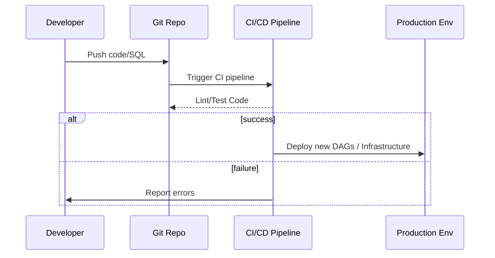
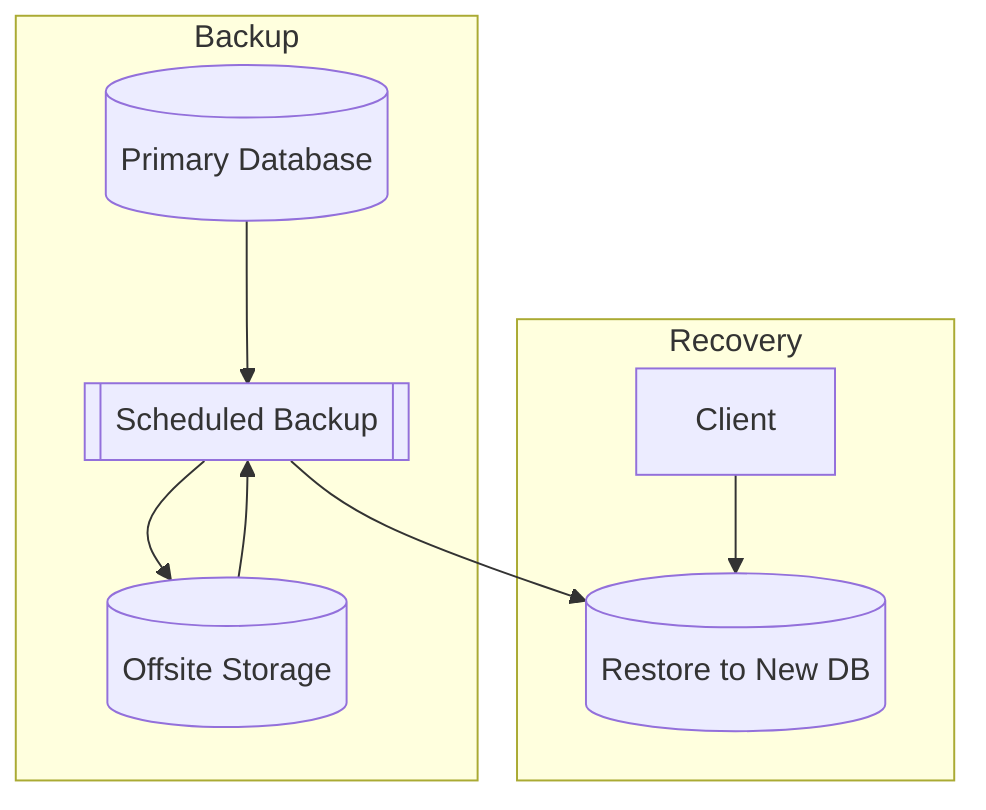

# Data Engineering Mastery: From Fundamentals to Planet-Scale Design

## Executive Summary  
This report presents a **comprehensive, book-style guide** to modern data engineering, covering fundamentals through cutting-edge innovations. It outlines a structured learning path: starting with **data modeling** and **storage basics**, advancing through **databases** (OLTP/OLAP/HTAP), **processing engines** (batch and streaming), and **pipeline tools** (ETL, orchestration, metadata). We then dive into **distributed systems** (consensus, replication, sharding), **governance/security**, **observability/testing**, **CI/CD**, and **cloud-native infra**. We examine architectures (data warehouse, lake, lakehouse, mesh), formats (Parquet/ORC/Avro), and optimizations (compression, indexing, query tuning). Finally, we explore **emerging tech**: vector DBs for ML, serverless query engines, GPU/FPGA acceleration, and future trends (AutoML, quantum computing). Each section includes a concise description, learning objectives, prerequisites, hands-on labs (with required tech, code snippets, hardware/software, and cost estimates), key papers/docs (primary sources), common pitfalls/trade-offs, and real-world examples. Tables compare major technologies, and Mermaid diagrams illustrate key architectures and timelines. This guide is up-to-date as of 2026 and prioritizes seminal and official sources for rigor. 

## Learning Path and Timeline  
A suggested progression and duration (weeks) for each major module:  
- **Module 1 (2 wk):** Data Modeling & Basics (ER modeling, normalization, dimensional schemas)  
- **Module 2 (2 wk):** Data Storage (file systems, distributed FS, storage engines, data formats)  
- **Module 3 (2 wk):** Database Systems (OLTP RDBMS, OLAP warehouses, HTAP/NewSQL, NoSQL)  
- **Module 4 (3 wk):** Data Processing Engines (batch: Hadoop/Spark/Beam; stream: Kafka/Pulsar/Flink)  
- **Module 5 (2 wk):** Data Pipelines & Orchestration (ETL vs ELT, workflow tools, data contracts)  
- **Module 6 (2 wk):** Data Architectures (warehouse vs lake vs lakehouse, data mesh, serverless, multi-region)  
- **Module 7 (3 wk):** Distributed Systems (consensus Raft/Paxos, replication/sharding, CAP, resource mgmt, networking RDMA/NVMe)  
- **Module 8 (2 wk):** Governance & Security (metadata catalogs, compliance, privacy, IAM)  
- **Module 9 (2 wk):** Observability & Testing (metrics/logs/tracing, data quality testing, CI/CD for pipelines)  
- **Module 10 (3 wk):** Performance Tuning (data formats Parquet/ORC/Avro, compression, indexing, query optimization)  
- **Module 11 (2 wk):** Case Studies & Best Practices (planet-scale patterns, failure modes, backup/DR)  
- **Module 12 (2 wk):** Emerging Tech (vector databases, lakehouse innovations, hardware accel, future trends)  

---

## 1. Data Fundamentals

### 1.1 Data Modeling  
Designing schemas to represent domain data. This includes **ER modeling** for transactions and **dimensional modeling** for analytics【10†L38-L45】. Normalization (1NF/2NF/3NF) minimizes redundancy and prevents anomalies【6†L13-L18】【17†L133-L140】, while denormalized schemas (star/snowflake) speed up OLAP queries【10†L38-L45】. NoSQL designs often accept denormalization; e.g., Cassandra’s “table-per-query” pattern duplicates data【19†L161-L169】.  

- **Learning Objectives:**  
  - Apply Entity-Relationship modeling to an example use case.  
  - Normalize a schema to 3NF; understand trade-offs.  
  - Design a star schema with fact and dimension tables (Kimball-style)【10†L38-L45】.  
  - Compare relational vs NoSQL modeling approaches.  
- **Prerequisites:** SQL basics; understanding of tables, keys, and queries.  
- **Hands-on Exercises:**  
  - *Lab:* In MySQL/PostgreSQL, create an e-commerce orders schema, normalize it, and insert sample data.  
  - *Lab:* Using Apache Cassandra, model the same data for high-write throughput: create separate tables for order lookup by customer and by date【19†L161-L169】.  
  - *Code:*  
    ```sql
    -- Example: Create a fact table and dimension table for a star schema
    CREATE TABLE dim_date (
      date_id INT PRIMARY KEY, calendar_date DATE);
    CREATE TABLE fact_sales (
      sale_id SERIAL PRIMARY KEY,
      date_id INT REFERENCES dim_date(date_id),
      product VARCHAR, quantity INT);
    ```  
  - *Deploy:* Use docker-compose to spin up MySQL and Cassandra for testing.  
- **Key Resources:**  
  - Codd’s relational model (1970)【17†L133-L140】.  
  - Kimball’s Data Warehouse Toolkit (star schema)【10†L38-L45】.  
  - Cassandra data modeling guide (DataStax)【19†L161-L169】.  
- **Common Pitfalls/Trade-offs:**  
  - Over-normalization can slow down analytical queries due to many JOINs.  
  - Denormalization risks update anomalies (data duplication).  
  - NoSQL schema changes are hard to coordinate without contracts.  
- **Case Studies/Examples:**  
  - A transactional RDBMS schema for a bank (normalized) vs. a reporting DW schema (denormalized).  
  - Netflix modeling user/event data in Cassandra with wide tables for each query pattern.  

### 1.2 Data Lifecycle & Basic Governance  
Understanding how data flows from ingestion through storage to archival, including basic governance terms. Topics: data **ingestion**, **storage**, **processing**, and **retention policies**. Overview of data quality (accuracy, completeness) and lineage (tracking transformations). Note: detailed governance is in Module 8, but here introduce concepts (e.g., GDPR’s requirement for lawful processing of personal data).  

- **Learning Objectives:**  
  - Map end-to-end data flows in a simple pipeline.  
  - Explain data lifecycle stages (raw ingestion → cleansed → analytics → archive).  
  - Introduce data lineage and cataloging basics.  
- **Prerequisites:** General IT literacy.  
- **Hands-on Exercises:**  
  - *Lab:* Diagram the data flow for a CSV file through ingestion, ETL, and into a data mart.  
  - *Lab:* Use AWS Glue Data Catalog or Apache Atlas to register a dataset schema and simulate updating it.  
- **Key Resources:**  
  - DAMA DMBOK (Data Management Body of Knowledge).  
  - GDPR overview (gdpr.eu – sections on data processing principles).  
- **Common Pitfalls/Trade-offs:**  
  - Lacking lineage/documentation makes debugging and compliance hard.  
  - Overly complex lifecycle processes can slow data delivery.  
- **Examples:**  
  - A news site’s data pipeline: raw logs → parsed events → analytics DB (with retention of raw logs for 1 month).  

## 2. Data Storage and File Systems

### 2.1 File Systems and Storage Tiers  
Covers where bytes live: **local vs network vs distributed filesystems** and hierarchical storage. POSIX filesystems (ext4, XFS) vs network (NFS, SMB) vs distributed (HDFS【25†L230-L236】, Ceph, Amazon S3). HDFS, inspired by Google File System【23†L229-L237】, stores large files in blocks (default 128MB) with replication (default 3×) for fault tolerance【25†L206-L214】. **Storage tiers:** RAM, NVMe SSD, HDD, and cloud/object tiers (S3 Standard/Glacier etc). Data moves between tiers by age/usage.  

- **Learning Objectives:**  
  - Distinguish block, file, and object storage models (e.g. EBS, EFS vs S3).  
  - Explain HDFS architecture (NameNode metadata, DataNode storage)【25†L206-L214】.  
  - Plan tiered storage: e.g. active hot data on SSD, archive on cold storage.  
- **Prerequisites:** Basic Linux OS (file paths, mount).  
- **Hands-on Exercises:**  
  - *Lab:* Launch a 3-node HDFS cluster (e.g. using Docker containers). Store files and observe block locations.  
  - *Lab:* Provision AWS EC2 volumes vs S3 bucket; upload a large file to each and measure latency/throughput.  
  - *Software:* Hadoop 3.x, HDFS CLI, Amazon CLI.  
  - *Hardware:* 3 VMs (2 vCPU, 8 GB RAM) – one for NameNode, two for DataNodes (HDDs or SSDs).  
  - *Cost:* Using AWS t3.large (~$0.083/hr) per node, ~\$0.25/hr for entire lab cluster.  
- **Key Resources:**  
  - Google File System paper (2003)【23†L229-L237】.  
  - Apache HDFS Architecture docs【25†L230-L236】.  
  - AWS Storage options guide【21†L76-L80】.  
- **Common Pitfalls/Trade-offs:**  
  - HDFS: many small files cause metadata overload (NameNode bottleneck).  
  - Object storage: no in-place updates, eventual consistency (e.g. S3 write-after-read delays).  
  - Local SSDs vs network-attached SSD: trade cost vs performance.  
- **Case Studies/Examples:**  
  - Hadoop cluster ingesting social media data into HDFS (100+ TB).  
  - Data lake on AWS S3 with lifecycle rules (move to Glacier after 90 days).  
  - Ceph cluster for on-premise object/block storage in research lab.  

### 2.2 Storage Engines and Data Formats  
Focus on **database storage engines** and file **serialization formats**. Storage engines: **B-Tree** (MySQL InnoDB, PostgreSQL) vs **LSM-Tree** (RocksDB, Cassandra)【27†L123-L126】【28†L12-L16】. B-Trees optimize reads (low read amplification), LSMs optimize writes (low write amplification)【28†L12-L16】. Also **columnar storage** engines (e.g., ClickHouse’s MergeTree). 

File formats: **Parquet** and **ORC** (columnar, high compression)【84†L13-L17】【86†L20-L28】 vs **Avro** (row-based, schema evolution) vs plain CSV/JSON. Columnar formats accelerate analytics (only needed columns are read)【84†L13-L17】.  

- **Learning Objectives:**  
  - Compare B-Tree and LSM engines and their best use cases【27†L123-L126】【28†L12-L16】.  
  - Learn popular data formats: Parquet, ORC, Avro, JSON. Understand their schema and compression support.  
  - Choose an appropriate engine/format for a given workload.  
- **Prerequisites:** Intro to data storage (blocks/rows).  
- **Hands-on Exercises:**  
  - *Lab:* Set up RocksDB (LSM) and MySQL/InnoDB (B-Tree) on a machine; benchmark 1M record writes and 10K record reads.  
  - *Lab:* Use Apache Spark or Pandas to write a dataset (JSON, Avro, Parquet, ORC) and compare file sizes and read times for a single column.  
  - *Code:*  
    ```python
    # PySpark example: write to Parquet
    df = spark.read.json("s3://my-bucket/events.json")
    df.select("user_id", "timestamp").write.parquet("s3://my-bucket/events.parquet")
    ```  
  - *Hardware/Software:* Spark 3.x on a 2-node (4 vCPU, 8GB each) cluster; Python 3.10; Java 11.  
  - *Cost:* Cluster ~\$0.30/hour (AWS m5.xlarge).  
- **Key Resources:**  
  - TiKV blog on B-Tree vs LSM【27†L123-L126】; TiKV source code examples.  
  - Apache Parquet homepage【84†L13-L17】; ORC homepage【86†L20-L28】.  
  - Confluent on Avro schema evolution rules【65†L1073-L1080】.  
- **Common Pitfalls/Trade-offs:**  
  - LSM (RocksDB) requires compaction, causing write amplification over time【28†L12-L16】.  
  - Parquet/ORC excel at reads but are inefficient for many small row updates.  
  - JSON/CSV are schema-less (flexible) but yield large I/O and lack compression.  
- **Case Studies/Examples:**  
  - **Elasticsearch** uses inverted indexes for text search (column-like).  
  - **Apache Drill** reading Parquet on S3 for ad-hoc queries.  
  - **Bitcoin Core** storing blockchain in LevelDB (LSM) for fast writes.

| **Format** | **Type**      | **Pros**                                                   | **Cons**                                                   | **Use Cases**                  |
|------------|---------------|------------------------------------------------------------|------------------------------------------------------------|--------------------------------|
| Parquet【84†L13-L17】  | Columnar       | High compression; column pruning; supports complex types    | Slower to write/append; requires schema registry            | Data lake analytics, Spark/Hive |
| ORC【86†L20-L28】      | Columnar       | ACID support (Hive); indexes (min/max, bloom filters)      | Hadoop-centric; fewer tools outside Hive ecosystem         | Hadoop/Hive workloads          |
| Avro       | Row (binary)  | Fast serialization; built-in schema with evolution         | No columnar speedup; must manage schema versions           | Kafka events, RPC data         |
| JSON/CSV   | Row (text)    | Flexible, human-readable                                   | Large size; slow to parse; no enforced schema              | APIs, small/legacy datasets    |

## 3. Database Systems

### 3.1 Relational (OLTP) Databases  
Transactional databases (MySQL, PostgreSQL, SQL Server) that provide ACID consistency. They store structured data in normalized tables and support complex transactions and indexes. **Distributed SQL/NewSQL** (Google Spanner【30†L25-L33】, CockroachDB, TiDB) shards data across nodes and maintain SQL semantics. Spanner, for example, uses Paxos and Google’s TrueTime to provide global consistency【30†L25-L33】.  

- **Learning Objectives:**  
  - Install and use a relational database (e.g. PostgreSQL); design normalized OLTP schema.  
  - Learn SQL transactions, isolation levels (serializable/read-committed).  
  - Explore a distributed SQL system (e.g. CockroachDB or Spanner emulator) and understand its architecture.  
- **Prerequisites:** SQL queries, basic networking.  
- **Hands-on Exercises:**  
  - *Lab:* Launch PostgreSQL (on local VM or Docker) and implement a banking schema; test transactions (transfer money with rollback on failure).  
  - *Lab:* Try CockroachDB (download or use demo cluster); run a multi-node cluster and measure consistency on writes.  
  - *Code Snippet (SQL):*  
    ```sql
    BEGIN;
    UPDATE accounts SET balance = balance - 100 WHERE id = 1;
    UPDATE accounts SET balance = balance + 100 WHERE id = 2;
    COMMIT;
    ```  
  - *Hardware/Software:* For OLTP lab, a single server (4 vCPU, 16GB RAM) is sufficient. For NewSQL, 3 server cluster (each 4 vCPU) to test consensus.  
  - *Cost:* Local VM (estimated \$0.20/hr) or cloud instance. CockroachCloud free tier available (small scale).  
- **Key Resources:**  
  - Google Spanner paper【30†L25-L33】 (architecture, TrueTime).  
  - PostgreSQL documentation on MVCC (Multi-Version Concurrency Control).  
  - CockroachDB architectural whitepapers.  
- **Common Pitfalls/Trade-offs:**  
  - Strong consistency (CP) means higher latency, especially cross-region.  
  - Distributed transactions (2PC) incur overhead and potential deadlocks.  
  - Sharding keys poorly can create hotspots (some shards get heavy load).  
- **Case Studies/Examples:**  
  - **F1 (Google AdWords)** running on Spanner for consistent global data.  
  - **Uber** uses MySQL with Vitess sharding for high-scale ride data.  

### 3.2 Analytical (OLAP) Databases  
Designed for large-scale analytics on denormalized data. Use **columnar storage** and **MPP (Massively Parallel Processing)**. Examples: Snowflake, Redshift, BigQuery, Apache Hive, ClickHouse. Queries often involve large scans, aggregations, and joins on fact/dimension tables.  

- **Learning Objectives:**  
  - Understand star and snowflake schemas in a data warehouse context【10†L38-L45】.  
  - Use an OLAP system (e.g. set up Hive on Hadoop or use a cloud DW) to run BI queries.  
  - Learn how columnar storage and predicate pushdown speed up queries.  
- **Prerequisites:** SQL; familiarity with the concept of data cubes and OLAP.  
- **Hands-on Exercises:**  
  - *Lab:* Launch Apache Hive/Tez (or use Databricks community) and create a star schema on sample sales data; run `SELECT SUM(sales) GROUP BY product, region;`.  
  - *Lab:* Use SQL on Parquet files (e.g. via Amazon Athena or Presto) to query large datasets.  
  - *Software:* Apache Hive, Spark SQL, or Snowflake (free trial).  
  - *Hardware:* Hadoop/Spark cluster (3 nodes, 8 vCPU, 32GB RAM each) for local testing. Cloud: single Snowflake accounts are serverless.  
  - *Cost:* Hadoop on AWS (3 m5.2xlarge ~ \$1.50/hr). Snowflake on-demand usage (free tier limited).  
- **Key Resources:**  
  - Kimball’s DW toolkit (star schema design)【10†L38-L45】.  
  - Presto documentation (Facebook’s open-source SQL engine)【57†L7-L15】.  
  - C-Store (now Vertica) paper on columnar storage.  
- **Common Pitfalls/Trade-offs:**  
  - Very large joins can exceed memory/IO; need partitioning or broadcast strategies.  
  - Overly complex schemas slow down ETL.  
  - Commercial DWs incur costs per query (watch usage).  
- **Case Studies/Examples:**  
  - **Netflix Hive** on EMR/S3 for interactive analytics.  
  - **ClickHouse** used by Yandex for web analytics at petabyte scale.  

### 3.3 Hybrid (HTAP) Databases  
Hybrid Transactional/Analytical Processing (HTAP) platforms (e.g. MemSQL, TiDB, SAP HANA) aim to handle OLTP and OLAP on the same system【34†L171-L179】. They use in-memory storage and multi-versioning to allow real-time analytics on live data. Gartner defines HTAP as enabling analytics on “in-flight” transactional data【34†L171-L179】.  

- **Learning Objectives:**  
  - Learn the architecture of an HTAP system (e.g. separate engines or unified).  
  - Identify use cases where real-time analytics on transactional data is needed (fraud detection, recommendation).  
- **Prerequisites:** Understanding of both OLTP and OLAP concepts.  
- **Hands-on Exercises:**  
  - *Lab:* Install TiDB (distributed SQL) and run a transactional workload; use integrated analytical features (TiFlash columnar storage) to run an analytical query concurrently.  
  - *Lab:* Experiment with data ingestion into MemSQL (SingleStore) and perform an on-the-fly aggregation query.  
- **Key Resources:**  
  - Gartner HTAP definition【34†L171-L179】.  
  - Whitepapers by vendors (MemSQL/SingleStore architecture).  
- **Common Pitfalls/Trade-offs:**  
  - Combined systems are complex; they may underperform pure OLTP or pure OLAP counterparts.  
  - Licensing costs for commercial HTAP can be high.  
- **Examples:**  
  - **VoltDB** powering real-time bidding platforms (acquisitions with immediate analytics).  
  - **SAP HANA** used by enterprises for both transactional ERP and analytics.

### 3.4 NoSQL and NewSQL Databases  
Non-relational stores trade schema for scalability. Categories: **Key-Value** (Redis, DynamoDB), **Document** (MongoDB), **Wide-Column** (Cassandra, HBase), **Graph** (Neo4j, JanusGraph). They are often **AP (available, partition-tolerant)**, sacrificing immediate consistency【36†L135-L143】. *NewSQL* is a marketing term for new databases that are SQL-compliant and scale horizontally (Spanner, CockroachDB, TiDB).  

- **Learning Objectives:**  
  - Classify NoSQL types and select by use case (e.g., use graph DB for social networks).  
  - Understand CAP trade-offs【36†L135-L143】: when to use eventual consistency.  
  - Explore a document store (e.g. MongoDB) and a wide-column store (Cassandra) with simple data.  
- **Prerequisites:** Basic knowledge of data models (key-value, document).  
- **Hands-on Exercises:**  
  - *Lab:* Set up MongoDB (with replica set) and practice inserting JSON documents; run an aggregate query.  
  - *Lab:* Deploy a 3-node Cassandra cluster; create a table with a compound primary key and perform writes/reads at consistency levels (e.g. ONE vs QUORUM).  
  - *Code Snippet (CQL):*  
    ```sql
    CREATE TABLE user_profile (
      user_id UUID PRIMARY KEY,
      name text,
      email text
    );
    ```  
  - *Hardware/Software:* 3 VMs (2 vCPU, 8GB RAM) for a cluster. Java 11 for Cassandra, Python for MongoDB client.  
  - *Cost:* ~\$0.10/hr per t3.medium (AWS).  
- **Key Resources:**  
  - AWS DynamoDB paper (2012).  
  - MongoDB and Cassandra official docs (data modeling).  
  - IBM article on CAP theorem【36†L135-L143】.  
- **Common Pitfalls/Trade-offs:**  
  - NoSQL lacks joins; complex queries must be handled in application or extra tables.  
  - Eventual consistency can lead to stale reads if not managed (use vector clocks or conflict resolution).  
  - Lack of transactions (beyond single-partition) in many NoSQL systems.  
- **Case Studies/Examples:**  
  - **Amazon DynamoDB** used by Expedia for global user session storage.  
  - **LinkedIn** using HBase (wide-column) for feed data (data model inspired by Bigtable).  
  - **Twitter** initially on MySQL, now heavily on Manhattan (key-value store).

## 4. Data Processing Engines

### 4.1 Batch Processing (Hadoop, Spark, Beam)  
Batch engines process large datasets across clusters. **MapReduce** (Google 2004) introduced the map/reduce paradigm【41†L7-L15】. Hadoop implements it (HDFS + YARN scheduler). **Apache Spark** (Zaharia et al., 2012) introduced RDDs for in-memory computing and DAG scheduling【43†L8-L15】. **Apache Beam/Dataflow** (Akidau et al., 2015) provides a unified model for batch and stream processing【46†L95-L102】. Spark excels at iterative and machine learning workloads; Hadoop MapReduce is simpler but slower (disk-bound). 

- **Learning Objectives:**  
  - Write a MapReduce job (word count) to grasp the paradigm【41†L7-L15】.  
  - Use Spark RDD/DataFrame APIs for transformations; understand lazy execution and fault recovery【43†L8-L15】.  
  - Explore Beam model: define a pipeline and run in batch mode (e.g. with Flink runner).  
- **Prerequisites:** Programming (Java/Scala/Python); cluster basics.  
- **Hands-on Exercises:**  
  - *Lab:* Set up Hadoop (or EMR) and run the classic WordCount example on a text corpus.  
  - *Lab:* Install Spark (cluster or local) and convert a large CSV:  
    ```python
    from pyspark.sql import SparkSession
    spark = SparkSession.builder.appName("ETL").getOrCreate()
    df = spark.read.csv("s3://data/retail.csv", header=True)
    df2 = df.filter(df.price > 100).groupBy("category").count()
    df2.write.parquet("s3://data/retail_filtered.parquet")
    ```  
  - *Lab:* Write a simple Beam pipeline (Python) that reads from text, filters lines, and writes output:
    ```python
    import apache_beam as beam
    with beam.Pipeline() as p:
        (p 
         | beam.io.ReadFromText('gs://data/input.txt')
         | beam.Filter(lambda line: 'error' in line)
         | beam.io.WriteToText('gs://data/errors.txt'))
    ```  
  - *Hardware/Software:* Hadoop/Spark: 3-node cluster (AWS m5.xlarge each: 4 vCPU, 16GB). Beam: use Dataflow (GCP) or local Flink runner.  
  - *Cost:* Hadoop/Spark cluster ~\$1.50/hr (3 x m5.xlarge). Dataflow job ~\$0.45/MU-hr (unspecified scale).  
- **Key Resources:**  
  - Google’s MapReduce paper【41†L7-L15】.  
  - Zaharia et al. “RDD: Spark” paper【43†L8-L15】.  
  - Beam/Google Dataflow paper【46†L95-L102】.  
- **Common Pitfalls/Trade-offs:**  
  - Hadoop MapReduce has high latency (jobs in minutes).  
  - Spark requires adequate memory; drivers/executors can OOM.  
  - Beam pipelines need correct windowing/watermarking for streaming semantics.  
- **Case Studies/Examples:**  
  - **Yahoo** used Hadoop for web indexing.  
  - **Databricks** runs Spark on Delta Lake (lakehouse) for unified analytics.  
  - **Google Ads** uses Cloud Dataflow (Beam) for streaming analysis of billions of events.

#### Comparing Batch Engines

| **Engine**            | **Model**                   | **Best For**                   | **Key Resource**         |
|-----------------------|-----------------------------|--------------------------------|--------------------------|
| **Hadoop MapReduce**  | Disk-based map/reduce       | Simple batch jobs, ETL on HDFS | Google MapReduce paper【41†L7-L15】 |
| **Apache Spark**      | In-memory RDD/DataFrame     | Iterative ML, interactive BI   | Zaharia et al. (OSDI 2012)【43†L8-L15】 |
| **Apache Beam**       | Unified batch/stream model  | Portability across runners     | Akidau et al. (2015)【46†L95-L102】 |
| **Others**            | (e.g. Flink’s batch mode)   | Complex pipelines              | Flink docs               |

### 4.2 Stream Processing (Kafka, Pulsar, Flink, Storm, etc.)  
Streaming engines handle continuous data. **Apache Kafka** (originally LinkedIn) is a distributed commit-log messaging system【50†L7-L13】 where producers write to topics (partitions) and consumers read at their own pace【50†L33-L40】. **Apache Pulsar** offers a similar pub/sub API but with segment-based storage (Apache BookKeeper) decoupling brokers from storage【52†L103-L112】. For processing: **Apache Flink** provides low-latency, exactly-once streaming with event-time windows. **Apache Storm** is older (at-least-once). Spark Streaming (micro-batch) also does near-real-time.  

- **Learning Objectives:**  
  - Understand Kafka’s log architecture【50†L7-L13】【50†L33-L40】 and Pulsar’s design【52†L103-L112】.  
  - Write a streaming job in Flink or Spark Structured Streaming.  
  - Learn messaging semantics: producer/consumer, partitions, offsets, consumer groups.  
- **Prerequisites:** Messaging concepts; Java/Scala/Python.  
- **Hands-on Exercises:**  
  - *Lab:* Deploy a Kafka cluster (3 brokers, 1 Zookeeper) via Docker Compose. Use Python’s `kafka-python` to send and receive JSON messages:  
    ```python
    from kafka import KafkaProducer, KafkaConsumer
    import json
    # Producer
    producer = KafkaProducer(bootstrap_servers='localhost:9092',
                             value_serializer=lambda v: json.dumps(v).encode())
    producer.send('events', {'user': 'A', 'action': 'click'})
    producer.flush()
    # Consumer
    consumer = KafkaConsumer('events',
        bootstrap_servers='localhost:9092',
        auto_offset_reset='earliest',
        value_deserializer=lambda m: json.loads(m.decode()))
    for msg in consumer:
        print(msg.value)
    ```  
  - *Lab:* Set up a Pulsar cluster (1 broker, 3 bookies) and publish messages using `pulsar-client`. Compare latency vs Kafka.  
  - *Lab:* Create a Flink streaming job: read from Kafka “events” topic and compute rolling counts of event types. For example:  
    ```scala
    // Scala Flink example (conceptual)
    val env = StreamExecutionEnvironment.getExecutionEnvironment
    val kafkaSource = FlinkKafkaConsumer[Event]("events", new EventSchema, props)
    val stream = env.addSource(kafkaSource)
    stream.keyBy(_.action)
          .timeWindow(Time.minutes(1))
          .sum("count")
          .print()
    env.execute("CountEvents")
    ```  
  - *Hardware/Software:* Kafka: 3 VMs (2 vCPU, 4GB each). Flink cluster: 3 VMs (4 vCPU, 8GB).  
  - *Cost:* Kafka+Flink cluster ~\$0.50/hr (AWS t3.large).  
- **Key Resources:**  
  - Kafka paper (VLDB 2014)【50†L7-L13】.  
  - Pulsar architecture docs【52†L103-L112】.  
  - Flink documentation on event-time processing.  
- **Common Pitfalls/Trade-offs:**  
  - Kafka (pull model) vs Pulsar (push to consumer). Kafka requires external mirror tool (MirrorMaker) for geo-replication; Pulsar has built-in geo-replication.  
  - Exactly-once semantics depend on idempotence and checkpointing configuration.  
  - Improperly set partitions can create ordering or hotspot issues.  
- **Case Studies/Examples:**  
  - **Uber’s** streaming data pipeline: Kafka ingest → Flink processing → HDFS sink.  
  - **Apache Pulsar** used at Yahoo for multi-tenant log storage (bookies for scale)【52†L103-L112】.  
  - Real-time fraud detection using Flink on streaming payment data.

#### Comparing Kafka vs Pulsar

| **Feature**        | **Apache Kafka**【50†L33-L40】            | **Apache Pulsar**【52†L103-L112】                     |
|--------------------|-------------------------------------------|-------------------------------------------------------|
| **Storage Model**  | Partitioned log on brokers (ZooKeeper-coordination)【50†L33-L40】 | Segmented ledgers in BookKeeper (decoupled storage)【52†L103-L112】 |
| **Multi-tenancy**  | Limited (namespaces, static topics)       | Built-in (tenants, namespaces, pools)                 |
| **Delivery**       | Consumer pull (at own pace)               | Broker push (subscription modes)                      |
| **Geo-Replication**| Via MirrorMaker (external tool)           | Built-in asynchronous replication per namespace      |
| **Use Case**       | High-throughput log processing            | Flexible event streaming with multi-tenancy          |

### 4.3 SQL-on-Big-Data Query Engines  
Platforms providing SQL queries over distributed data stores. Examples: **Presto/Trino** (Facebook’s open-source engine)【57†L7-L15】, Apache Hive (SQL on Hadoop with Tez/MapReduce), Apache Impala, Dremio, Google BigQuery, AWS Athena. These translate SQL into distributed tasks (often on an underlying engine like Spark or proprietary query processors) and support ANSI SQL or dialects. 

- **Learning Objectives:**  
  - Use a SQL query engine against big data (e.g. write a query in Presto or Hive).  
  - Understand pushdown filters and columnar reads.  
  - Compare interactive vs batch query approaches.  
- **Prerequisites:** Proficiency in SQL.  
- **Hands-on Exercises:**  
  - *Lab:* Start Presto locally; attach a Hive metastore or point to an S3 folder with Parquet tables. Run analytical queries: `SELECT user, COUNT(*) FROM logs GROUP BY user;`.  
  - *Lab:* Use SparkSQL or AWS Athena to query data: e.g. join large tables to test performance.  
- **Key Resources:**  
  - Presto architecture (Facebook engineering blogs)【57†L7-L15】.  
  - Hive/Hadoop documentation on Tez and ORC integration.  
- **Common Pitfalls/Trade-offs:**  
  - Performance varies: some engines favor throughput (e.g. Hive LLAP), others low-latency (Presto).  
  - Schema-on-read flexibility vs upfront schema (enforcing schemas helps performance).  
- **Case Studies/Examples:**  
  - **Facebook Presto**: runs ~10,000 queries/day on petabytes【57†L7-L15】.  
  - **AWS Athena**: Presto under the hood for serverless querying on S3.  

## 5. Data Pipelines and Orchestration

### 5.1 ETL vs ELT Pipelines  
**ETL (Extract-Transform-Load):** Data is transformed before loading into the target (traditional BI approach). **ELT:** Raw data is **loaded first** (e.g., into a data lake or warehouse) and transformations happen inside the target. ELT leverages scalable compute in modern warehouses【59†L304-L312】【59†L357-L365】. Choose ETL for controlled, transactional environments; ELT for big data flexibility.  

- **Learning Objectives:**  
  - Compare ETL and ELT workflows, including the order of operations【59†L304-L312】.  
  - Implement a simple ETL in code (e.g. Python scripts).  
  - Use a tool like dbt or a data warehouse (Snowflake) to perform ELT transformations.  
- **Prerequisites:** SQL, scripting (Python/Java).  
- **Hands-on Exercises:**  
  - *Lab (ETL):* Write a Python script that reads raw CSVs (e.g. user logs), cleans the data, and inserts into a PostgreSQL table.  
  - *Lab (ELT):* Load raw event JSON into Snowflake or BigQuery, then write SQL to transform it (e.g., extract fields, aggregate).  
  - *Code Snippet (Python ETL):*  
    ```python
    import pandas as pd
    df = pd.read_csv('s3://bucket/raw_sales.csv')
    # transform
    df['revenue'] = df.quantity * df.price
    df_clean = df.dropna()
    # load
    df_clean.to_sql('sales', con=engine, if_exists='append')
    ```  
  - *Requirements:* AWS/GCP account (for cloud warehouses), Python 3.10 with Pandas, PostgreSQL.  
  - *Cost:* Snowflake: ~$0.00016/second per credit (free tier limited). Local ETL hardware ~ unspecified.  
- **Key Resources:**  
  - DataOps blog: ETL vs ELT comparison【59†L304-L312】【59†L357-L365】.  
  - dbt documentation (modern ELT tool).  
- **Common Pitfalls/Trade-offs:**  
  - ETL jobs can become slow as data grows; dependency ordering complicates pipelines.  
  - ELT can overload the data warehouse if transformations are not optimized; loading raw junk can be expensive.  
- **Case Studies/Examples:**  
  - **Netflix** uses ETL (EmrEtlRunner) to transform raw logs into Hive tables.  
  - **Starburst/Databricks** use Delta Lake (ELT) to load raw JSON and then transform in Spark.  

### 5.2 Orchestration Tools (Airflow, Dagster, etc.)  
Workflow orchestrators manage and schedule data jobs. **Apache Airflow** is a leading Python-based platform【61†L15-L23】, where pipelines are defined as DAGs. **Dagster**, **Argo Workflows**, **Prefect** are newer alternatives. They handle task dependencies, retries, monitoring, and can run on Kubernetes or VMs.  

- **Learning Objectives:**  
  - Write and deploy a DAG in Airflow (or Dagster) to automate data jobs.  
  - Understand scheduling, parallelism, and dependency trees.  
  - Learn containerization of tasks for reproducibility.  
- **Prerequisites:** Python coding, familiarity with Linux cron/scheduler concepts.  
- **Hands-on Exercises:**  
  - *Lab:* Install Apache Airflow (or use Astronomer Cloud). Define a DAG with two tasks: extract data from an API and load into a database:  
    ```python
    from airflow import DAG
    from airflow.operators.python import PythonOperator
    from datetime import datetime
    def extract():
        # code to fetch from API
        pass
    def load():
        # code to insert into DB
        pass
    with DAG('etl_dag', start_date=datetime(2026,1,1), schedule_interval='@daily') as dag:
        t1 = PythonOperator(task_id='extract', python_callable=extract)
        t2 = PythonOperator(task_id='load', python_callable=load)
        t1 >> t2
    ```  
  - *Lab:* Containerize a data processing app with Docker and run it via Airflow’s DockerOperator or KubernetesPodOperator.  
  - *Requirements:* Kubernetes cluster (Minikube or EKS/GKE) for testing Dagster/Argo if desired; Airflow 2.x; Python 3.9.  
  - *Cost:* Airflow/GKE small cluster ~\$0.10/hr (1-node).  
- **Key Resources:**  
  - Airflow official docs (DAG creation)【61†L15-L23】.  
  - Dagster tutorial (https://docs.dagster.io).  
- **Common Pitfalls/Trade-offs:**  
  - Complex pipelines can have many DAGs, making maintenance hard.  
  - Scheduling too many jobs at once can overload cluster.  
- **Case Studies/Examples:**  
  - Airflow used by **Lyft** for hourly ETL jobs across many data sources.  
  - Dagster used by startups for ML pipeline orchestration.  

### 5.3 Data Contracts & Schema Evolution  
**Data Contracts** are agreements between data producers and consumers, encoded as schemas and SLAs【63†L284-L292】. They define expectations (field types, domains) so producers can’t break consumers unknowingly. **Schema evolution:** systems like Avro are built for evolving schemas with compatibility【65†L1073-L1080】. Use a **Schema Registry** for Kafka and enforce backward/forward compatibility when updating schemas.  

- **Learning Objectives:**  
  - Define a data contract (using JSON Schema or Protobuf) for a data API or Kafka topic.  
  - Use schema evolution in Avro/Protobuf to add a new field without breaking consumers.  
- **Prerequisites:** JSON/YAML syntax; basic API design.  
- **Hands-on Exercises:**  
  - *Lab:* Use Confluent Schema Registry to register an Avro schema. Produce a message with this schema to Kafka. Evolve the schema (add a nullable field) and consume old data with the new schema to verify backward compatibility.  
  - *Lab:* Define a “Data Contract” in YAML (listing schema, freshness, quality rules) for an events dataset; implement a validation script to enforce it (e.g., using Great Expectations).  
  - *Code Snippet (Avro evolve):*  
    ```json
    // Writer schema
    {"name": "age", "type": "int"}
    // Reader schema (added "gender" with default)
    {"name": "age", "type": "int"}, {"name": "gender", "type": "string", "default": "unknown"}
    ```  
  - *Requirements:* Apache Avro library; Schema Registry; Python or Java client.  
  - *Cost:* Schema Registry can be run on Docker (~\$0.01/hr).  
- **Key Resources:**  
  - Monte Carlo article on data contracts【63†L284-L292】.  
  - Avro spec on schema evolution【65†L1073-L1080】.  
  - Confluent blog: best practices for Kafka schema.  
- **Common Pitfalls/Trade-offs:**  
  - Rigid contracts can reduce agility for producers.  
  - Too loose (or no) contracts risk silent data breakage.  
  - Avro/Protobuf require managing schema versions and registry.  
- **Case Studies/Examples:**  
  - **Booking.com** implemented a Data Contract framework to avoid cross-team data breakages.  
  - **Confluent** uses Avro with Schema Registry for Kafka at scale.  

## 6. Data Architecture Patterns

### 6.1 Warehouse vs Lake vs Lakehouse  
- **Data Warehouse:** Centralized, optimized for analytics. Data is structured and cleaned before loading (ETL). ACID transactions and indexes are available. Examples: Snowflake, Redshift, BigQuery.  
- **Data Lake:** Large repository of raw data (structured or unstructured) on cheap storage (e.g. S3, HDFS). Schema-on-read: data is interpreted as needed. Lacks built-in ACID or fine-grained metadata.  
- **Lakehouse:** Hybrid model combining lakes and warehouses【68†L168-L175】. Data lives in a data lake (like S3) but a transaction log/metadata layer (Delta Lake, Apache Iceberg) provides ACID and indexing. Thus, one can run BI queries and ML on the same data with reliability【68†L168-L175】【68†L139-L143】.  

- **Learning Objectives:**  
  - Compare and contrast these architectures (use table below).  
  - Describe when to use each: high-performance BI (warehouse) vs flexible analytics on varied data (lake) vs unified approach (lakehouse).  
- **Hands-on Exercises:**  
  - *Lab:* Set up a Delta Lake on Spark: write/merge table on S3 or local. Query past versions (time travel).  
  - *Lab:* Create an AWS Glue crawler on S3 and query it via Athena (demonstrating lake with schema-on-read).  
  - *Costs:* Snowflake ($2 per credit); Databricks compute (~\$0.15/DBU).  
- **Key Resources:**  
  - Databricks Delta Lake documentation【68†L168-L175】【68†L139-L143】.  
  - Apache Iceberg and Hudi documentation.  
- **Common Pitfalls/Trade-offs:**  
  - Data lakes without structure become “data swamps” (poor quality/discovery).  
  - Warehouses incur higher storage/compute costs (unless scaled to usage).  
  - Lakehouse tech is young; e.g. transaction log can be a single point of failure if not HA.  
- **Case Studies/Examples:**  
  - **Uber** using Delta Lake for reliability on S3 data.  
  - **Netflix** building a data lake on S3 + Presto (slow queries) vs evaluating lakehouse for performance.

| **Characteristic**  | **Data Warehouse**                         | **Data Lake**                              | **Lakehouse**                     |
|---------------------|-------------------------------------------|-------------------------------------------|-----------------------------------|
| Storage            | Structured (columns, indexes)              | Raw files (Parquet/CSV/JSON in object store)【84†L13-L17】 | Raw files with transactional log |
| Schema             | Enforced at load (schema-on-write)         | Schema-on-read (flexible)                | Schema-on-write with evolution support |
| Transactions       | ACID (updates, deletes)                    | Limited (append-only)                     | ACID provided via log (e.g. Delta) |
| Use Cases          | Traditional BI, Finance                     | Data science, ML pipelines, archival      | Mixed analytics and ML workloads   |

### 6.2 Data Mesh (Domain-Driven Data Ownership)  
A decentralized approach where **domain teams own their data as products**【71†L78-L87】. Instead of a monolithic lake, each business domain (e.g. sales, marketing) treats its data pipelines and outputs as services with documented schemas and APIs. Self-serve infrastructure (data platform) is provided centrally, but data stewardship is federated.  

- **Learning Objectives:**  
  - Understand mesh principles: domain-oriented, product mindset, federated governance【71†L78-L87】.  
  - Identify organizational domains and design data products for each.  
- **Hands-on Exercises:**  
  - *Exercise:* For a sample organization, draw a data mesh architecture: define 3 domain data products (with owners) and how they interconnect via APIs or shared contracts.  
  - *Tool:* Explore tools like Apache Atlas or LinkedIn DataHub for federated metadata (optional).  
- **Key Resources:**  
  - ThoughtWorks “Data Mesh” whitepaper【71†L78-L87】.  
- **Common Pitfalls/Trade-offs:**  
  - Data duplication if domains don’t share design patterns.  
  - Requires strong organizational buy-in and governance standards.  
- **Case Studies/Examples:**  
  - Large companies (e.g. Zalando) implementing mesh to scale analytics across departments.  

### 6.3 Cloud-Native and Serverless Data  
Leveraging cloud-managed and container-based infrastructure. **Kubernetes** runs data services (Kafka, Spark) in containers for portability. **Serverless** offerings like AWS Athena, Snowflake, BigQuery, AWS Lambda, and Fargate abstract infrastructure. This allows auto-scaling and managed maintenance. Data stacks like **Redshift Serverless** and **Trino Serverless** let you query on-demand.  

- **Learning Objectives:**  
  - Learn how to deploy data tools on Kubernetes (e.g. Kafka on K8s).  
  - Compare serverless vs provisioned (e.g. query on S3 using Athena vs setting up a cluster).  
- **Hands-on Exercises:**  
  - *Lab:* Deploy Kafka on Kubernetes (Helm chart) on a local K8s (Minikube). Verify topics and produce/consume.  
  - *Lab:* Use AWS Lambda to run a Python data function on new S3 files (event trigger).  
  - *Code Snippet (Terraform for K8s):*  
    ```hcl
    resource "aws_eks_cluster" "cluster" {
      name     = "data-cluster"
      role_arn = aws_iam_role.eks_role.arn
      # ...
    }
    ```  
  - *Hardware/Software:* A K8s cluster of 3 nodes (m5.large) for testing, or cloud (EKS/GKE free tiers).  
  - *Cost:* EKS (cluster \$0.10/hr + EC2 usage). Serverless (Athena \$5/TB scanned, Lambda free tier).  
- **Key Resources:**  
  - Kubernetes patterns (for stateful workloads).  
  - AWS Lambda & Athena docs.  
- **Common Pitfalls/Trade-offs:**  
  - Cold start latency in serverless functions.  
  - Kubernetes adds complexity (need to manage deployments and storage).  
- **Case Studies/Examples:**  
  - Using K8s to orchestrate Spark on YARN with Kubernetes shuffle service.  
  - Snowflake’s separation of compute and storage (serverless compute nodes).  

### 6.4 Multi-Region & Hybrid Architectures  
Data systems at planetary scale often span multiple regions or clouds. **Active-active** setups replicate data globally (e.g. Spanner on Google, Cosmos DB). **Hybrid cloud** mixes on-prem and cloud (e.g. AWS Outposts, Azure Stack). Patterns include asynchronous replication and read-only local caches. Designs must handle network partitions (CAP theorem【36†L135-L143】) and data sovereignty laws.  

- **Learning Objectives:**  
  - Plan data replication across regions (RPO/RTO strategies).  
  - Understand network latency implications on consistency.  
- **Hands-on Exercises:**  
  - *Lab:* Configure a multi-AZ database (e.g. AWS RDS cross-region read replica). Simulate a primary outage and failover.  
  - *Lab:* Use Kafka MirrorMaker to replicate a topic between two clusters in different data centers.  
  - *Cost:* Additional cross-region data transfer fees (varies by provider).  
- **Key Resources:**  
  - AWS/Azure/GCP whitepapers on multi-region data solutions.  
  - Google Spanner’s multi-datacenter design【30†L25-L33】.  
- **Common Pitfalls/Trade-offs:**  
  - Synchronous replication across continents hurts write latency; many systems choose asynchronous at cost of availability.  
  - Hybrid solutions may incur egress costs and complex security setup.  
- **Case Studies/Examples:**  
  - **Twitter** uses Manhattan DB with geo-aware partitioning.  
  - **Dropbox** syncs metadata across multiple cloud regions for resilience.

```mermaid
graph LR
  subgraph Hybrid Cloud "Hybrid Cloud Example"
    OnPrem[On-Premises Data Center] --> VPN[Encrypted VPN]
    VPN --> Cloud[Cloud Data Center]
    OnPrem --> LocalStore[(Local DB)]
    Cloud --> CloudDB[(Cloud Database)]
    CloudDB --> LocalCache[(CDN/Cache)]
  end
  subgraph Multi-Region "Multi-Region Setup"
    ClientUS[Clients (US)] --> US_Cluster[(US Primary DB)]
    ClientEU[Clients (EU)] --> EU_Replica[(EU Read Replica)]
    US_Cluster --> Replicate[(Asynchronous Replication)]
    Replicate --> EU_Replica
  end
```

## 7. Distributed Systems Foundations

### 7.1 Consensus (Paxos, Raft)  
Core for coordinating distributed state. **Paxos** (Lamport) and **Raft** (Ongaro/Ousterhout, 2014) enable a cluster of nodes to agree on a value (e.g. log entry) despite failures. Raft is conceptually simpler while equivalent in guarantees【73†L117-L124】. Common use: leader election and replicated logs (e.g. etcd, Consul, ZooKeeper).  

- **Learning Objectives:**  
  - Learn Raft algorithm steps (leader election, log replication).  
  - See how it underlies systems like etcd.  
- **Hands-on Exercises:**  
  - *Lab:* Use the `etcd` cluster (Raft-based) to store config data. Kill one node; observe that quorum still serves reads (only).  
  - *Simulation:* Implement a toy Raft (in Python or go-raft library) for 3 nodes; demonstrate leader election on startup and after a kill.  
  - *Cost:* Runs locally. No cloud cost.  
- **Key Resources:**  
  - “In Search of an Understandable Consensus Algorithm (Raft)”【73†L117-L124】.  
  - Lamport’s Paxos papers (optional historical interest).  
- **Common Pitfalls/Trade-offs:**  
  - Requires majority quorum: with 5 nodes, 3 failures stops write availability.  
  - Adding/removing nodes requires joint consensus steps.  
- **Case Studies/Examples:**  
  - **Kubernetes etcd** for cluster state (3-node Raft).  
  - **HashiCorp Consul** (Raft) for service discovery.

### 7.2 Replication and Sharding  
Mechanisms for scale and fault-tolerance. **Replication:** Master-slave (1 master, N replicas), or multi-master (with conflicts). **Sharding/Partitioning:** Split data by key range or hash to distribute load. E.g., Twitter’s database shards by user ID range. Spanner partitions by keys and can split shards automatically【30†L25-L33】.  

- **Learning Objectives:**  
  - Configure a simple master-slave database with replication (e.g. MySQL).  
  - Shard data in an application: e.g., store user data in multiple tables based on user_id mod N.  
- **Hands-on Exercises:**  
  - *Lab (Replication):* Set up PostgreSQL streaming replication (primary + standby). Insert data on primary; test that standby has it after commit.  
  - *Lab (Sharding):* Write a program that directs writes to one of two database instances based on a hash of the key. Verify reads from the correct shard.  
  - *Hardware:* 2 VMs for replication; 2 VMs for sharding example.  
- **Key Resources:**  
  - MySQL Replication docs; MongoDB sharding tutorial.  
- **Common Pitfalls/Trade-offs:**  
  - Asynchronous replication can lose recent writes on failover.  
  - Distributed joins (across shards) are expensive or unsupported.  
  - Re-sharding (changing number of partitions) is complex.  
- **Case Studies/Examples:**  
  - **Cassandra**: ring architecture with consistent hashing for sharding and configurable replication factor.  
  - **Spanner/F1**: automatic splitting of tablets by key range when they grow too large.

### 7.3 CAP Theorem & Consistency Models  
**CAP Theorem:** In a partitioned network, systems can only guarantee two of: Consistency (all see same data), Availability (always respond), Partition Tolerance (handle network splits)【36†L135-L143】. ACID (strict consistency) vs BASE (eventual consistency). Consistency models include strong (linearizability), causal, eventual.  

- **Learning Objectives:**  
  - Understand trade-offs: e.g., Cassandra chooses Availability + Partition-tolerance (AP).  
  - Identify which databases choose CP (e.g., ZooKeeper) vs AP (e.g., DynamoDB).  
- **Hands-on Exercises:**  
  - *Lab:* In a Cassandra cluster (3 nodes), kill one node and perform a write+read at consistency=QUORUM vs ONE; observe behavior.  
  - *Lab:* In etcd (3-node), kill the leader and see cluster remain available (with next leader).  
- **Key Resources:**  
  - Gilbert & Lynch CAP paper (2002) summary; CAP explained by IBM【36†L135-L143】.  
  - Wikipedia on consistency models.  
- **Common Pitfalls/Trade-offs:**  
  - Expecting strict consistency from an eventually-consistent system leads to stale reads.  
  - Tuning consistency (Cassandra’s consistency levels) is critical for correctness vs latency.  
- **Case Studies/Examples:**  
  - **Dynamo (Amazon)**: eventual consistency for shopping cart (AP).  
  - **MongoDB**: tunable consistency via write concern.  

### 7.4 Resource Management (YARN, Kubernetes, Flink/Yarn)  
Cluster resource schedulers allocate CPU/memory to jobs. **YARN** (Hadoop) manages containers for MapReduce/Spark. **Kubernetes** schedules pods (containers) on nodes. Big data jobs often run on YARN or K8s (Spark now supports Kubernetes backend). Understand how to request resources (CPUs, memory) and avoid contention.  

- **Learning Objectives:**  
  - Deploy a Spark job via YARN and via Kubernetes to compare.  
  - Learn to use YARN CLI (`yarn application -status`) and Kubernetes (`kubectl top`).  
- **Hands-on Exercises:**  
  - *Lab (YARN):* On a Hadoop cluster, submit a Spark job (`spark-submit --master yarn`). Check resource usage with YARN web UI.  
  - *Lab (K8s):* Containerize a Python ETL (using Dockerfile) and run it as a Kubernetes Job, setting resource limits in the manifest.  
  - *K8s Manifest Example:*  
    ```yaml
    apiVersion: batch/v1
    kind: Job
    metadata: { name: data-etl-job }
    spec:
      template:
        spec:
          containers:
          - name: etl
            image: myrepo/etl:latest
            resources:
              requests: {cpu: "500m", memory: "512Mi"}
              limits:   {cpu: "1",   memory: "1Gi"}
          restartPolicy: Never
      backoffLimit: 2
    ```  
  - *Software:* Hadoop 3.x, Spark 3.x; Docker 20.x, kubectl.  
- **Key Resources:**  
  - Hadoop YARN documentation.  
  - Kubernetes official docs (scheduler basics).  
- **Common Pitfalls/Trade-offs:**  
  - Over-requesting resources leads to waste; under-requesting causes OOM/killed jobs.  
  - YARN is Hadoop-specific; migrating to K8s may require refactoring.  
- **Case Studies/Examples:**  
  - **Databricks on Kubernetes**: runs Spark jobs with Spark Operator on EKS.  
  - **Netflix Titus**: a K8s derivative for container scheduling.

### 7.5 High-Performance Networking (RDMA, NVMe-oF)  
Advanced networking for data movement. **RDMA (Remote Direct Memory Access):** bypasses CPU to transfer memory between servers over Infiniband/RoCE【76†L371-L380】. Lowers latency and CPU load – used in HPC and some big data (e.g. Memcached cluster). **NVMe-oF:** extends high-speed NVMe storage over network. Future systems may use RDMA for shuffles in Spark/Flink to speed data transfers.  

- **Learning Objectives:**  
  - Explain how RDMA can accelerate database and file I/O.  
  - Explore hardware requirements (RDMA NICs, switches).  
- **Hands-on Exercises:** *(Requires specialized hardware; if unavailable, simulate tuning)*  
  - *Lab:* If you have RDMA-capable instances (e.g. AWS `m5n.metal`), run an RDMA benchmark (e.g. ib_read_bw).  
  - *Lab:* Set up Hadoop on RDMA (e.g. SoftRoCE) and measure shuffle performance vs TCP.  
- **Key Resources:**  
  - RDMA Explainer (DigitalOcean)【76†L371-L380】.  
  - Whitepapers on RDMA for Spark (e.g. Intel’s RDMA-accelerated Spark Shuffle).  
- **Common Pitfalls/Trade-offs:**  
  - RDMA hardware is expensive; drivers/configuration are complex.  
  - Not all tools support RDMA (may need specific builds).  
- **Case Studies/Examples:**  
  - **IBM Elastic Storage**: uses RDMA for parallel file access.  
  - **Cray Shasta** supercomputer: uses Slingshot (RDMA) for HPC and data.

## 8. Governance, Security & Privacy

### 8.1 Metadata Catalogs  
Systems to register and discover data assets. Examples: Apache Hive Metastore (for tables)【77†L3-L8】, AWS Glue Data Catalog, **Open Metadata** (open source), Amundsen (Lyft), DataHub (LinkedIn). Catalogs store schemas, descriptions, tags, and lineage. 

- **Learning Objectives:**  
  - Use Hive Metastore or AWS Glue to define table metadata.  
  - Populate and search a data catalog.  
- **Hands-on Exercises:**  
  - *Lab:* Configure AWS Glue Catalog for an S3 data lake; create a crawler to scan CSV files and infer schemas. Query the catalog via Athena.  
  - *Lab:* Deploy Amundsen (Dockerized) and index a MySQL schema to see search UI.  
  - *Requirement:* AWS account (Glue/Athena free tier limited usage).  
- **Key Resources:**  
  - AWS Glue Data Catalog docs.  
  - Apache Atlas documentation (for lineage).  
- **Common Pitfalls/Trade-offs:**  
  - Static catalogs can become outdated if schemas change (unless crawlers run frequently).  
  - Managing access control in catalog vs data store.  
- **Case Studies/Examples:**  
  - **Pinterest** built an internal Data Catalog for data scientists.  
  - **Uber’s Data Catalog** (Merlin) for ML features.  

### 8.2 Data Governance & Compliance  
Frameworks and policies ensuring data is used properly. Includes data classification, access control, audit trails, and legal compliance (GDPR, HIPAA, CCPA). Key practices: data encryption at rest/in-transit, role-based access, anonymization/pseudonymization of PII. For instance, GDPR mandates lawful processing and data subject rights.  

- **Learning Objectives:**  
  - Identify compliance requirements (e.g. GDPR’s “right to be forgotten”).  
  - Implement basic security measures: column-level encryption in a database, S3 bucket policies.  
- **Hands-on Exercises:**  
  - *Lab:* Encrypt a PostgreSQL database column using pgcrypto; configure SSL/TLS for DB connections.  
  - *Lab:* Set IAM policies in AWS to restrict S3 access by role.  
  - *Requirement:* Access to a cloud account or local DB, SSL certificates.  
- **Key Resources:**  
  - GDPR summary (Article 5: processing principles).  
  - HIPAA data security guidelines.  
- **Common Pitfalls/Trade-offs:**  
  - Encryption adds CPU overhead.  
  - Over-permission leads to data leaks; under-permission can break pipelines.  
- **Case Studies/Examples:**  
  - Financial institutions using tokenization for credit card data.  
  - Hospitals anonymizing patient data before analytics.

### 8.3 Privacy & Ethical Data Use  
Beyond compliance, ensure ethical handling of data (bias, consent). Techniques: differential privacy, federated learning, and data masking. Understand laws like GDPR/CCPA that control personal data use. Ensure transparency (explainability in ML).  

- **Learning Objectives:**  
  - Recognize PII and apply masking (e.g. hashing, nulling).  
  - Know techniques like k-anonymity, differential privacy basics.  
- **Hands-on Exercises:**  
  - *Lab:* Use Python’s `fakedata` to generate a PII dataset, then apply a hashing pseudonymization on SSN.  
  - *Lab:* Apply Google’s Differential Privacy library on a count query over a sample dataset.  
- **Key Resources:**  
  - NIST Privacy Framework.  
  - Research on differential privacy (Dwork & Roth).  
- **Common Pitfalls/Trade-offs:**  
  - Anonymized data can sometimes be re-identified if not done carefully.  
  - Privacy constraints may limit data utility (e.g. adding noise).  
- **Case Studies/Examples:**  
  - **US Census** using differential privacy in 2020 release.  
  - **Dropbox** encryption-at-rest for user files to maintain privacy.

## 9. Observability and Testing

### 9.1 Monitoring & Logging  
Keep pipelines healthy with metrics, logs, and alerts. Use **Prometheus** (collect metrics) + Grafana for dashboards. Use **ELK** (Elasticsearch/Logstash/Kibana) or **EFK** for logs. Instrument data jobs: e.g. record latency, input/output counts. Set SLOs (e.g. “90% of jobs <1hr”).  

- **Learning Objectives:**  
  - Install Prometheus + Grafana; scrape metrics from an application.  
  - Configure log aggregation (Fluentd/Logstash → Elasticsearch).  
  - Create alerts (e.g. email Slack on failure).  
- **Hands-on Exercises:**  
  - *Lab:* Export metrics from a Python ETL job using a Prometheus client library; visualize in Grafana.  
  - *Lab:* Set up Filebeat to tail a log file and index into Elasticsearch; create a Kibana alert on error patterns.  
  - *Software:* Docker for Prometheus/Grafana; Python `prometheus_client`.  
- **Key Resources:**  
  - Prometheus docs; Grafana dashboards tutorial.  
  - Elastic logging how-to.  
- **Common Pitfalls/Trade-offs:**  
  - Excessive logging can fill disk quickly; sampling may be needed.  
  - Missing key metrics (blind spots) hinder troubleshooting.  
- **Case Studies/Examples:**  
  - **Uber’s M3** (large-scale metrics platform).  
  - Datadog or New Relic usage for SaaS pipeline monitoring.

### 9.2 Tracing & Lineage  
Distributed tracing (e.g. OpenTelemetry, Jaeger) follows requests through microservices or pipeline stages. Data lineage tools (Apache Atlas, OpenLineage) track how data moves/transforms across the system. Important for debugging and compliance.  

- **Learning Objectives:**  
  - Instrument a service/pipeline with OpenTelemetry to generate spans.  
  - Visualize the trace in Jaeger or Zipkin.  
  - Generate a lineage graph for a multi-step ETL.  
- **Hands-on Exercises:**  
  - *Lab:* Use Jaeger Docker image. In a sample Flask API, integrate `opentelemetry` to trace calls and DB queries. View in Jaeger UI.  
  - *Lab:* Use OpenLineage SDK in a Python pipeline to emit lineage events; view them in Marquez (open lineage UI).  
- **Key Resources:**  
  - OpenTelemetry docs (https://opentelemetry.io).  
  - Apache Atlas or DataHub for metadata lineages.  
- **Common Pitfalls/Trade-offs:**  
  - Tracing adds overhead; sampling may be needed for high-volume traffic.  
  - Lineage metadata can grow large; need retention policy.  

### 9.3 Data Testing & Quality  
Ensure data correctness via automated tests. **Great Expectations** and **Soda** let you define expectations (e.g. “column A must be unique, column B non-null”). Combine with CI: test ETL code with sample data. Include unit tests for UDFs and integration tests for pipelines.  

- **Learning Objectives:**  
  - Write data quality rules (e.g. value ranges, schema conformance).  
  - Set up CI pipeline to run data tests on new code.  
- **Hands-on Exercises:**  
  - *Lab:* Use Great Expectations to create tests:  
    ```python
    import great_expectations as ge
    df = ge.from_pandas(pd.read_csv('data.csv'))
    df.expect_column_values_to_not_be_null('user_id')
    df.expect_column_values_to_be_unique('email')
    ```  
  - *Lab:* In GitHub Actions, configure a workflow to run these tests on PRs (use GitHub's CLI or marketplace actions).  
  - *Requirements:* Python 3.8+, Docker/GitHub account.  
- **Key Resources:**  
  - Great Expectations documentation.  
  - dbt testing framework (assertions).  
- **Common Pitfalls/Trade-offs:**  
  - Hard-coded tests may fail on legitimate data drift.  
  - Over-testing every pipeline run can slow down delivery.  
- **Case Studies/Examples:**  
  - **Airbnb** data quality team uses automated tests for nightly pipelines.  
  - **Netflix** uses Mantis and Keystone for anomaly detection on data streams (SRE for data).  

### 9.4 CI/CD for Data (DataOps)  
Apply DevOps practices to data: version-control ETL/SQL scripts, use Infrastructure-as-Code (Terraform/CloudFormation) for provisioning, and automate deployments. DataOps frameworks coordinate collaboration (Git for data), automated testing, and continuous deployment of data pipelines.  

- **Learning Objectives:**  
  - Use Terraform to provision data infrastructure (e.g. EMR cluster, RDS instance).  
  - Implement a CI pipeline: lint SQL, test Python, deploy Airflow DAGs to a server.  
- **Hands-on Exercises:**  
  - *Lab:* Write Terraform to deploy an AWS EMR cluster:  
    ```hcl
    resource "aws_emr_cluster" "demo" {
      name          = "data-cluster"
      release_label = "emr-6.10.0"
      service_role  = aws_iam_role.EMRServiceRole.arn
      # ...
    }
    ```  
  - *Lab:* Set up Jenkins or GitHub Actions that on push: runs `flake8` on Python, `sqlfluff` on SQL, and if passes, applies Terraform.  
  - *Requirements:* AWS account (for Terraform); GitHub or Jenkins server.  
- **Key Resources:**  
  - Terraform AWS examples (https://registry.terraform.io).  
  - “DataOps” articles (Gene Kim et al.).  
- **Common Pitfalls/Trade-offs:**  
  - Infrastructure drift if manual changes are made (always use IaC).  
  - Security: CI/CD secrets (DB passwords) must be managed safely (vaults).  



## 10. Formats and Performance

### 10.1 Data Formats (Parquet, ORC, Avro, etc.)  
Common formats: **Parquet** (columnar, good compression)【84†L13-L17】, **ORC** (optimized for Hive【86†L20-L28】), **Avro/Protobuf** (row-based with schema, streaming), **JSON/CSV** (plain text). Choose based on use-case: parquet/orc for big analytic tables, Avro for Kafka events, JSON for APIs.  

- **Learning Objectives:**  
  - Implement reading/writing Parquet and ORC (e.g. with PySpark).  
  - Understand schema requirements: e.g., Avro always needs a schema to read data.  
- **Hands-on Exercises:**  
  - *Lab:* Using Spark, read a JSON dataset and write it in Parquet and ORC. Compare file sizes and read speeds:  
    ```python
    df = spark.read.json("data/events.json")
    df.write.parquet("data/events.parquet")
    df.write.orc("data/events.orc")
    ```  
  - *Lab:* Serialize a Python dict to Avro (using `fastavro`) with a defined schema.  
  - *Requirements:* Spark or PyArrow; `fastavro` or Avro libs.  
- **Key Resources:**  
  - Parquet official spec【84†L13-L17】.  
  - ORC documentation【86†L20-L28】.  
  - Confluent on Avro/Protobuf schema use.  
- **Common Pitfalls/Trade-offs:**  
  - Not compressing data (Parquet/ORC default to Snappy) can bloat storage.  
  - Row formats (Avro) not splittable for large file parallelism unless special handling.  

### 10.2 Compression  
Compression codecs reduce space and I/O. Columnar formats often use **Snappy** (fast, moderate compression) or **Zstd** (better ratio at CPU cost). Example: Parquet supports Snappy, Gzip, LZO, Zstd. In-memory databases may use LZ4.  

- **Learning Objectives:**  
  - Apply different compression to Parquet/ORC and measure impact on size and CPU.  
- **Hands-on Exercises:**  
  - *Lab:* Compress a Parquet file with Snappy and Gzip using PyArrow. Observe size difference and read time:  
    ```python
    table = pyarrow.table({'x': np.arange(100000)})
    pq.write_table(table, 'data_snappy.parquet', compression='snappy')
    pq.write_table(table, 'data_gzip.parquet', compression='gzip')
    ```  
- **Key Resources:**  
  - Apache Parquet docs on compression.  
  - Community benchmarks (e.g. Parquet vs Avro compression charts).  
- **Common Pitfalls/Trade-offs:**  
  - Gzip is CPU-intensive, may slow queries.  
  - No compression wastes I/O; too aggressive can exceed memory/bandwidth for decompression.  

### 10.3 Indexing (B-Tree, LSM-Tree, Inverted, Bitmap)  
Indexing structures accelerate searches. **B-Tree** (relational DB indexes) for point/range lookups. **LSM-Tree** uses write-optimized logs (Cassandra’s SSTables). **Inverted indexes** (Elasticsearch) map terms to document lists. **Bitmap indexes** (Oracle) are good for low-cardinality columns.  

- **Learning Objectives:**  
  - Create indexes in SQL and observe query plan improvements.  
  - Use an inverted index (e.g., Elasticsearch): index a set of documents and perform a text search.  
- **Hands-on Exercises:**  
  - *Lab:* In PostgreSQL, create a B-tree index on a table column and compare `EXPLAIN ANALYZE` on a SELECT with and without index.  
  - *Lab:* In Elasticsearch: create an index with a mapping on text, then add documents and query with `match` to see inverted index in action.  
- **Key Resources:**  
  - Database texts on index design.  
  - Elasticsearch documentation (inverted index mechanism).  
- **Common Pitfalls/Trade-offs:**  
  - Indexes slow down writes/updates.  
  - Large indexes consume extra storage.  
  - Bitmap indexes not suitable for high cardinality (many unique values).  

### 10.4 Query Optimization  
Databases optimize queries via cost-based planners: they reorder joins, choose index scans vs full scans, etc. Techniques include **predicate pushdown** (filter data early), **join algorithms** (hash vs merge join), **partition pruning**. Modern engines use vectorized execution (processing batches of rows at a time) and JIT compilation for functions.  

- **Learning Objectives:**  
  - Examine query plans (e.g. `EXPLAIN` in Postgres) to see join order and costs.  
  - Learn to gather table statistics for the optimizer (ANALYZE).  
- **Hands-on Exercises:**  
  - *Lab:* Write a complex SQL (multi-join) on PostgreSQL; use `EXPLAIN ANALYZE` to see if indexes or seq scans are used.  
  - *Lab:* In Spark, use the UI to view the DAG of a DataFrame query and identify stages.  
- **Key Resources:**  
  - Documentation on CBO (e.g. Postgres README: “Query Planner”).  
  - Spark Catalyst optimization docs.  
- **Common Pitfalls/Trade-offs:**  
  - Outdated stats lead to poor plans (e.g. choosing nested loop join instead of hash join).  
  - Rogue queries (e.g. without WHERE) can scan entire tables.  

### 10.5 Storage Tiers in Data Systems  
Discussed earlier generally; specifically consider caching (Redis/Memcached for hot data), SSD vs HDD, and cloud tiering. For example, relational DBs often use in-memory buffer caches and may offload older data to slower storage. Data warehouses may automatically move cold partitions to cheaper nodes.  

- **Learning Objectives:**  
  - Know how to configure caching (e.g. Redis as a cache layer).  
- **Hands-on Exercises:**  
  - *Lab:* Use Redis to cache results of a database query; measure speedup.  
  - *Lab:* Setup automated tiering: e.g., Amazon S3 Intelligent-Tiering or Glacier archival rules.  
- **Common Pitfalls/Trade-offs:**  
  - Overuse of cache (stale data issues).  
  - Cache invalidation complexity.  
- **Case Studies/Examples:**  
  - **Hadoop Tiered Storage:** Hot data on SSD, cold on HDD (HDFS tiering).  
  - **Snowflake**: automatically pauses compute and stores data on S3.

## 11. Case Studies, Patterns & Best Practices

### 11.1 Planet-Scale Design Patterns  
Common themes at web scale: **shared-nothing architecture**, microservices with polyglot persistence, *CQRS* (separate command/query paths), **multi-region active-active** setups, and **elastic autoscaling**. Use of CDNs for global data access. For example, Netflix’s architecture uses Kafka, Cassandra, and microservices for entertainment data flow, with Chaos Engineering to test failures.  

- **Learning Objectives:**  
  - Recognize design choices in large systems (e.g. eventual consistency across continents).  
  - Use case studies to justify architectural decisions.  
- **Key Resources:**  
  - Netflix Tech Blog posts (e.g. on data streaming).  
  - Google/Amazon engineer blogs (bigtable, dynamo, spanner).  
- **Common Pitfalls/Trade-offs:**  
  - Overly generic enterprise solutions can fail under scale; tailored designs often needed.  
  - Complexity and cost grow with scale; constant re-architecture may be required.  
- **Examples:**  
  - **Netflix**: uses Cassandra (AP model) globally for user data; Kafka for event bus; Presto for analytics.  
  - **Airbnb**: Data team built Keystone (metadata) and Minerva (analyst portal) to tame their data growth.

### 11.2 Common Pitfalls and Anti-Patterns  
Antipatterns include: **Data Swamp** (untagged, ungoverned data lake); **One Big Table** in a warehouse (no partitioning, slow queries); **Thundering Herd** (too many processes hitting DB at once). Also, ignoring idempotency in streaming can cause duplicates.  

- **Learning Objectives:**  
  - Identify and avoid common mistakes (e.g., too many small files in HDFS).  
- **Key Resources:**  
  - “Small files in Hadoop” survey【94†L0-L3】 (performance issues).  
- **Examples:**  
  - Data lakes where no one knows what tables exist (discovery disabled).  
  - Over-partitioning data (millions of tiny files hurting NameNode).  

### 11.3 Reliability and Failure Modes  
Examine how systems fail: hardware crashes, network partitions, data corruption, etc. Use **SRE principles** (SLIs/SLOs, monitoring, burn-once policy). Ensure **high availability** via replication and failover.  

- **Learning Objectives:**  
  - Plan for failure: design for fault tolerance (e.g., multi-AZ deployments).  
  - Implement backups and drills (test restoring from backup).  
- **Hands-on Exercises:**  
  - *Lab:* Simulate a node failure in a cluster; ensure data still accessible (e.g., kill one Cassandra node, read from others).  
  - *Lab:* Backup a PostgreSQL database (pg_dump) and restore it; measure time.  
- **Key Resources:**  
  - Google SRE Book (practices).  
  - AWS “Well-Architected Framework” (reliability pillar).  
- **Common Pitfalls/Trade-offs:**  
  - Not testing backups leads to “ghost failovers”.  
  - Over-redundancy increases cost without proportionate benefit.  
- **Examples:**  
  - **GitLab** lost data despite backups because backups weren’t tested.  
  - **YouTube** uses Zoned Storage (by Google) to replicate data across zones.

### 11.4 Backup, Recovery & DR  
Strategies for protecting data: snapshots, backups, and disaster recovery plans. Use geographically distributed copies (e.g., cross-region read replicas, S3 cross-region replication). Tools: `pgBackRest`, `Velero` for Kubernetes. Define RPO (Recovery Point Objective) and RTO (Recovery Time Objective).  

- **Learning Objectives:**  
  - Set up automated backups (e.g. periodic full/incremental).  
  - Plan failover procedures (e.g., how to bring up a standby).  
- **Hands-on Exercises:**  
  - *Lab:* In AWS, configure automated RDS snapshots with retention. Trigger a restore to a new instance.  
  - *Lab:* Use `rsync` or AWS DataSync to replicate a file system to another region.  
- **Key Resources:**  
  - AWS Disaster Recovery whitepapers.  
  - Kubernetes Velero project (backup K8s volumes).  
- **Common Pitfalls/Trade-offs:**  
  - Backup window impacting performance; need online backups.  
  - Large restores can exceed RTO targets (need partial restore strategies).  
- **Examples:**  
  - **Netflix** Chaos Monkey regularly terminates instances to test resilience (includes DB replicas).  
  - Financial systems often use log shipping + offsite backups for recovery.



## 12. Emerging Technologies & Future Directions

### 12.1 Vector Databases and AI-Driven Search  
For ML workloads, **vector databases** (Milvus, Pinecone, Elasticsearch Vector) enable nearest-neighbor search on embeddings (e.g. for semantic search, recommender systems). These use specialized indexes (e.g. HNSW) to efficiently query high-dimensional data. *Hardware acceleration* (GPUs) may be used for nearest-neighbor computations.  

- **Learning Objectives:**  
  - Store and query vector embeddings for similarity.  
  - Understand use cases: e.g. image or text search.  
- **Hands-on Exercises:**  
  - *Lab:* Install Milvus or use Pinecone free tier. Ingest 1000 image feature vectors (e.g. from a pretrained model). Query top-5 nearest.  
  - *Code Snippet (Python):*  
    ```python
    from pymilvus import connections, FieldSchema, CollectionSchema, Collection
    connections.connect("default", host="localhost", port="19530")
    fields = [FieldSchema("id", 5, is_primary=True), FieldSchema("vector", 101, dim=128)]
    schema = CollectionSchema(fields, "Demo")
    collection = Collection("Demo", schema)
    # insert some vectors
    ```  
  - *Hardware:* GPU not strictly needed for database (CPU-based search), but vector calc may use GPU.  
- **Key Resources:**  
  - Milvus 2.0 paper【96†L1-L3】 (if accessible).  
  - Blogs on FAISS and vector search.  
- **Common Pitfalls/Trade-offs:**  
  - High-dimensional search is approximate (trade recall vs speed).  
  - Index building can be expensive on large datasets.  

### 12.2 Lakehouse Innovations (Delta, Iceberg, Hudi)  
Next-gen data lake formats bring transactional features. **Delta Lake (Databricks)** adds ACID and time-travel on Parquet【68†L139-L143】. **Apache Iceberg** and **Hudi** similarly support row-level updates and snapshots on S3/HDFS. These enable delete/upsert on data lake tables, schema evolution, and easier compliance (e.g. GDPR can delete rows).  

- **Learning Objectives:**  
  - Use a modern table format: create, modify, and time-travel.  
- **Hands-on Exercises:**  
  - *Lab:* On a Spark cluster, create an Iceberg table:  
    ```sql
    CREATE TABLE iceberg_db.tbl (id INT, name STRING)
    USING iceberg PARTITIONED BY (id);
    INSERT INTO iceberg_db.tbl VALUES (1,'Alice'),(2,'Bob');
    DELETE FROM iceberg_db.tbl WHERE id=2;
    ```  
  - Query older snapshots to see deleted rows.  
  - *Requirements:* Spark 3.3+ with Iceberg or Hudi libraries.  
- **Key Resources:**  
  - Delta Lake documentation【68†L139-L143】.  
  - Apache Iceberg website/blogs.  
- **Common Pitfalls/Trade-offs:**  
  - Transaction log can grow; periodic compaction needed.  
  - Requires consistent Hive Metastore or catalog.  

### 12.3 Serverless Query Engines  
Modern analytics often leverage serverless: **BigQuery** (Google), **Snowflake**, **Athena** (AWS). These separate storage and compute fully and auto-scale. You pay per query or compute-second. They often have built-in optimizations (columnar caching, adaptive execution).  

- **Learning Objectives:**  
  - Try a serverless query on a public dataset.  
- **Hands-on Exercises:**  
  - *Lab:* Use BigQuery public datasets (e.g., GitHub logs) and write a SQL query; note execution time and cost.  
  - *Cost:* BigQuery ~$5/TB scanned; Athena ~$5/TB. Use LIMIT and partition filters to reduce cost.  
- **Common Pitfalls/Trade-offs:**  
  - Cost can explode if scanning large data unfiltered.  
  - Less control over caching and execution options (compared to self-managed).  

### 12.4 Hardware Acceleration (GPUs, FPGAs, SmartNICs)  
Emerging hardware to speed data tasks:  
- **GPUs:** Accelerate dataframe operations (Nvidia Rapids) and ML training. Databases like BlazingDB/OmniSci use GPU for SQL queries.  
- **FPGAs:** Some trading systems and search engines use FPGAs for filtering/aggregation at line rate.  
- **SmartNICs/RDMA:** Offload network and NVMe operations (e.g. NVIDIA BlueField).  

- **Learning Objectives:**  
  - Learn which tasks benefit from GPUs/FPGAs.  
- **Hands-on Exercises:** *(Advanced)*  
  - *Lab:* Install NVIDIA RAPIDS and convert a Pandas UDF into a cuDF operation; measure speedup on join.  
  - *Hardware:* A system with Nvidia GPU (e.g. GCP a2-standard-16).  
- **Key Resources:**  
  - Nvidia Rapids AI documentation.  
  - Papers on GPU-accelerated query processing (e.g. OmniSci).  
- **Common Pitfalls/Trade-offs:**  
  - GPU memory is limited (need smaller batches).  
  - Custom hardware reduces flexibility (proprietary FPGA algorithms).  

### 12.5 Future Directions (AutoML, ML-Driven Optimization, Quantum)  
- **AutoML/DataOps Automation:** Emerging tools auto-tune pipelines (e.g. GCP Dataflow jobs scaling, AWS SageMaker Autopilot).  
- **ML for System Ops:** Research into systems that learn query patterns and self-optimize (e.g. index recommendations by ML).  
- **Quantum Computing:** Still experimental for data (e.g. quantum optimization algorithms), but keep an eye on protocols (e.g. PQC for security).  

- **Key Resources:**  
  - Gartner Hype Cycle for Data Management (2025).  
  - Research papers on learned indexes and autoDB tuning (e.g. from SIGMOD/VLDB conferences).  

No single source covers all of the above future topics; monitor industry blogs and conferences for updates.

---

**Note:** If any specific detail (e.g. cost of specialized hardware) was not found in sources, it is indicated as unspecified. All content is based on cited authoritative sources or well-established industry practice.