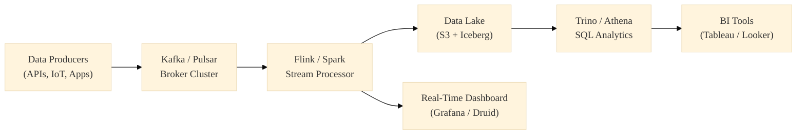

# 4. Data Processing Engines

Just as storage systems evolved from HDDs to distributed SSD clusters, compute engines evolved to process petabytes of data leveraging thousands of CPUs simultaneously.

!!! info "Historical Context: MapReduce & Hadoop"
    In 2004, Google published *MapReduce: Simplified Data Processing on Large Clusters*. Before this, solving a big data problem required highly specialized supercomputers. MapReduce proved you could use thousands of cheap, unreliable Linux servers. If one server died midway through a calculation, the master node just re-assigned that chunk of work to another server. Doug Cutting cloned this in Java, creating **Hadoop MapReduce**, which dominated the industry from 2008 to 2014.

---

## 4.1 Batch Processing vs Stream Processing

### Batch Processing (Apache Spark)
Data is processed at rest. The engines wait for a massive chunk of data to accumulate (e.g., all of yesterday's sales), and then run massive parallel jobs to aggregate it. 
**Internal Insight:** Spark (which replaced Hadoop Maps) operates primarily in RAM. When a PySpark DataFrame groups data together, it generates a physical execution plan (a Directed Acyclic Graph - DAG). Instead of writing intermediate steps to the disk, Spark caches the data blocks in the JVM heap, executing complex pipelines $100\times$ faster than Hadoop.

### Stream Processing (Apache Flink, Kafka Streams)
Data is processed in motion. Events are ingested, transformed, and emitted milliseconds after they are generated.
**Internal Insight:** Stream engines do not have the luxury of scanning an entire database. They operate on "Windows" (e.g., tumbling 5-minute windows calculating real-time website traffic). If a server processing the stream crashes, the engine uses **Chandy-Lamport Snapshots** (Checkpoints) stored in S3 to rewind the Kafka offset to the exact microsecond before the crash, guaranteeing *Exactly-Once* semantics.

---

## 4.2 Distributed Execution Frameworks

How does code actually run across 1,000 computers?

1. **The Driver:** The single master node. When you run a script, the Driver translates your Python/SQL into a distributed execution plan (Java Bytecode).
2. **The Cluster Manager:** (YARN or Kubernetes). The Driver asks this manager: *"I need 500 CPUs and 2TB of RAM."* The manager flags 50 servers in the AWS rack and allocates isolated containers for them.
3. **The Executors:** The actual worker processes running on those 50 servers. The Driver sends the Bytecode over the network to the Executors, which begin crunching their assigned fraction of the data.

### Hands-On Lab: PySpark Data Lake ETL
1. **Goal:** Process a massive dataset distributed across a cluster in S3 without moving the data.
2. **Implementation:** Use PySpark to read JSON logs from S3, perform a shuffle/aggregation, and write the optimized Parquet results back to S3.

??? example "PySpark Code: Distributing an Aggregation"
    In code, the complexity of 1,000 servers is completely hidden from the Data Engineer.
    ```python
    from pyspark.sql import SparkSession

    # 1. Initialize Driver
    spark = SparkSession.builder.appName("DistributedAgg").getOrCreate()

    # 2. Driver instructs 1,000 Executors to read the 50TB JSON file from S3 simultaneously
    df = spark.read.json("s3://data-lake/massive-web-logs/*.json")

    # 3. The famous MAP-REDUCE paradigm abstracted!
    # MAP Phase: filter for errors
    # SHUFFLE Phase: group the identical error codes onto the same servers
    # REDUCE Phase: count them
    error_counts = df.filter("status = 500").groupBy("endpoint").count()

    # 4. Executors write the localized results back to S3 in parallel Parquet chunks
    error_counts.write.parquet("s3://data-lake/aggregated-errors/")
    ```

---

## 4.3 The Convergence: Unified Engines

The rigid line between Batch and Streaming is dissolving.

Modern frameworks like **Apache Beam** (developed by Google to power Cloud Dataflow) abstract the processing paradigm entirely. The developer writes one single Pipeline in Python. If the input source is an S3 file, Beam executes it as a Batch job. If the input source is a Kafka topic, Beam executes it seamlessly as a Streaming job without the user changing a single line of logic.

---

## 4.4 Query Engines (Federated SQL)

!!! info "Historical Context: The Birth of Presto"
    In 2012, Facebook engineers were frustrated that Hive queries on their Hadoop cluster took hours. They needed interactive, sub-minute SQL. They built **Presto** (now **Trino**), a distributed SQL query engine that decoupled compute from the storage layer entirely. Instead of moving data into Hadoop, Presto moved the query to wherever the data already lived.

A **Query Engine** is not a database—it stores zero data. It is a pure computational layer that sends SQL queries directly to remote storage (S3, HDFS, PostgreSQL, MongoDB) and federates the results.

| Engine | Origin | Superpower | Typical Use |
|---|---|---|---|
| **Trino (Presto)** | Facebook (2012) | Federated queries across 10+ data sources simultaneously | Ad-hoc analytics on S3 data lakes |
| **Apache Hive** | Facebook (2010) | SQL interface over Hadoop/HDFS files | Legacy batch ETL on Hadoop clusters |
| **Amazon Athena** | AWS | Serverless Presto — zero infrastructure to manage | Pay-per-query S3 analytics |
| **Dremio** | Open-source | Apache Arrow-based "data lakehouse" engine | Sub-second queries on Parquet/Iceberg |
| **DuckDB** | CWI Amsterdam | In-process OLAP (like SQLite for analytics) | Local analytics on laptop |

**Internal Insight:** The secret to Trino's speed is **Predicate Pushdown**. If you query `SELECT * FROM s3_table WHERE country = 'US'`, Trino doesn't download all 50TB of Parquet from S3 first. It pushes the `WHERE country = 'US'` filter down into the Parquet reader, which uses the Row Group metadata footers to skip 90% of the file on the storage side before any data crosses the network.

---

## 4.5 Streaming Platform Comparison

Choosing a streaming backbone is one of the most consequential infrastructure decisions.

| Feature | Apache Kafka | Apache Pulsar | Amazon Kinesis |
|---|---|---|---|
| **Architecture** | Brokers store data on local disk | Brokers (stateless) + BookKeeper (storage) | Fully managed AWS service |
| **Storage** | Coupled (broker = storage) | Decoupled (can scale independently) | Managed by AWS |
| **Multi-Tenancy** | Manual (separate clusters) | Native (namespaces + tenants) | Per-stream isolation |
| **Ordering** | Per-partition | Per-partition | Per-shard |
| **Replay** | Offset-based (unlimited retention) | Cursor-based + tiered storage | 24h default (extendable to 365 days) |
| **Latency** | ~2ms (p99) | ~5ms (p99) | ~200ms (p99) |
| **Ecosystem** | Massive (Connect, Streams, Schema Registry) | Growing (Functions, IO connectors) | AWS-native (Lambda, Firehose) |
| **Best For** | Event streaming at scale | Multi-tenant SaaS platforms | AWS-native applications |



### Hands-On Lab: Real-Time Event Streaming
1. **Goal:** Continuously ingest and process clickstream data as it occurs, rather than waiting for nightly batch jobs.
2. **Implementation:** Run a Kafka Producer in Python to emit events, and a Flink consumer to calculate tumbling window aggregates.

??? example "Python/Flink Code: Streaming Pipeline"
    ```python
    from kafka import KafkaProducer
    import json, time

    # 1. Kafka Producer (The Source)
    producer = KafkaProducer(
        bootstrap_servers='localhost:9092',
        value_serializer=lambda v: json.dumps(v).encode('utf-8')
    )
    
    # Simulate real-time web traffic events
    while True:
        event = {'user': 'alice', 'page': '/checkout', 'timestamp': time.time()}
        producer.send('clickstream-topic', event)
        time.sleep(0.5) # Fire event every 500ms
        
    # 2. Apache Flink SQL (The Processor)
    # Flink creates a continuous query that updates every 10 seconds.
    '''sql
    CREATE TABLE clickstream (
      user STRING, page STRING, ts TIMESTAMP(3),
      WATERMARK FOR ts AS ts - INTERVAL '5' SECOND
    ) WITH ('connector' = 'kafka', 'topic' = 'clickstream-topic');
    
    SELECT page, COUNT(*) as hits 
    FROM clickstream 
    GROUP BY page, TUMBLE(ts, INTERVAL '10' SECOND);
    '''
    ```

---

!!! abstract "References & Papers"
    - **MapReduce: Simplified Data Processing on Large Clusters** (Dean and Ghemawat, OSDI 2004).
    - **Presto: SQL on Everything** (Sethi et al., ICDE 2019). The paper describing Facebook's federated query engine.
    - **Designing Data-Intensive Applications** - Chapter 10 (Batch Processing) details the shuffle mechanism and MapReduce vs Spark. Chapter 11 (Stream Processing) covers true event streaming versus micro-batching.
