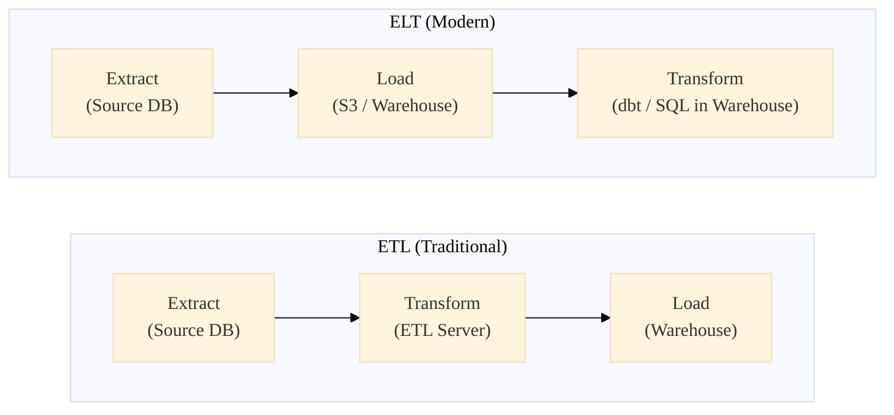

# 5. Data Pipelines & Orchestration

A data pipeline is the logistical nervous system of a company. It ensures that raw bytes originating in a production PostgreSQL database actually transform into the executive's Tableau dashboard without crashing overnight.

!!! info "Historical Context: The Death of Crontab"
    In the early 2010s, most data pipelines were managed by Linux `cron` jobs calling bash scripts at specific times. If the 2:00 AM extraction script failed, the 3:00 AM transformation script would still run, corrupting the database. Data engineering teams spent half their week manually hunting down which dependent jobs to rerun. In 2015, Maxime Beauchemin built **Apache Airflow** at Airbnb, introducing the concept of Directed Acyclic Graphs (DAGs) as Python code, bringing software engineering rigor to data logistics.

---

## 5.1 ETL vs. ELT

This is the most critical architectural decision in pipeline design, shaped entirely by the cost of storage over computing history.

### ETL: Extract, Transform, Load (The Past)
- **Era:** The 1990s and 2000s (Informatica, Talend).
- **Architecture:** You extract data from a source system, process it on a specialized intermediary Transformation Server, and then load the cleansed result into the final Data Warehouse.
- **Why?** Enterprise Data Warehouses (like Oracle Exadata) were incredibly expensive. Storage cost millions of dollars, so you mathematically could not afford to store the messy raw data in the database. You threw it away mid-pipeline.

### ELT: Extract, Load, Transform (The Present)
- **Era:** The 2010s to present (dbt, Fivetran, Snowflake, BigQuery).
- **Architecture:** You blindly Extract raw data and immediately Load an exact copy into cheap Cloud Storage or a Cloud Warehouse. Then, you use the massive parallel processing power *of the warehouse itself* to execute SQL scripts that Transform the data into clean tables.
- **Why?** Amazon S3 made storage essentially free. Cloud DBs separated compute from storage. If an analyst realizes a bug was introduced during transformation 5 months ago, they can just rewrite the SQL script and re-run it against the raw historical data sitting untouched in S3. 



---

## 5.2 Orchestration (Directed Acyclic Graphs)

Modern pipelines are orchestrated using tools like Apache Airflow, Dagster, or Prefect. 
A **DAG (Directed Acyclic Graph)** explicitly declares dependencies. 

**Internal Insight:** DAGs enforce idempotency. An idempotent pipeline can be run 100 times for January 1st to fix a bug, and the final analytical table will look exactly the same as if it ran successfully the very first time. You never run `INSERT INTO`; you run `DELETE WHERE date = X` followed by `INSERT INTO`.

### Hands-On Lab: Airflow Orchestration
1. **Goal:** Define a dependency graph where task B only runs if task A succeeds.
2. **Implementation:** Write a Python DAG using Apache Airflow to extract API data, run a Spark job, and email a status report.

??? example "Python Code: Apache Airflow DAG"
    ```python
    from airflow import DAG
    from airflow.operators.python_operator import PythonOperator
    from airflow.providers.apache.spark.operators.spark_submit import SparkSubmitOperator
    from datetime import datetime, timedelta

    default_args = {
        'owner': 'data_engineering',
        'retries': 3,
        'retry_delay': timedelta(minutes=5),
    }

    def extract_api_data():
        print("Extracting data from Stripe API...")
        # (Fetch data and save to S3)

    with DAG('daily_revenue_pipeline', 
             default_args=default_args, 
             schedule_interval='@daily', 
             start_date=datetime(2026, 1, 1),
             catchup=False) as dag:

        extract_task = PythonOperator(
            task_id='extract_stripe_data',
            python_callable=extract_api_data
        )

        transform_task = SparkSubmitOperator(
            task_id='spark_transform',
            application='s3://scripts/revenue_transform.py',
            conn_id='spark_default'
        )

        # Explicitly define the Directed Acyclic Graph dependency:
        # transform_task will ONLY execute if extract_task completes successfully.
        extract_task >> transform_task
    ```

??? example "dbt (Data Build Tool): Modeling the Transform loop"
    In the modern ELT paradigm, tools like `dbt` have completely replaced 10,000-line Python scripts for the "Transform" phase. Data Engineers simply write `SELECT` SQL statements. `dbt` handles building the dependency graph (DAG) and running them in the correct order in Snowflake.
    ```sql
    -- file: models/marts/dim_users.sql
    
    with raw_users as (
        -- {{ ref() }} dynamically builds the DAG dependency!
        select * from {{ ref('stg_salesforce_users') }}
    ),
    raw_stripe as (
        select * from {{ ref('stg_stripe_customers') }}
    )
    
    select 
        u.user_id,
        u.email,
        s.lifetime_value
    from raw_users u
    left join raw_stripe s on u.email = s.email
    where u.is_active = true
    ```

---

## 5.3 Streaming Pipelines (The Lambda / Kappa Architectures)

When a company wants both historical batch analytics and ultra-low latency dashboards, they choose a macro-architecture:

- **Lambda Architecture (2014):** You run two parallel pipelines. The Kafka stream feeds into a Flink pipeline (producing real-time approximate views) AND logs to an S3 bucket (producing slow daily batch jobs that overwrite and correct the real-time views). It creates a nightmare where you have to maintain the same business logic in two different programming languages.
- **Kappa Architecture (2016):** You throw away the batch pipeline entirely. Everything is a stream. The database is just a Kafka topic with unlimited retention. If you need a historical report from 2021, you spin up a massive Flink job to "fast-forward" the entire 4 years of history sitting in Kafka.

---

## 5.4 Schema Evolution & Data Contracts

!!! info "Historical Context: The $10M Schema Break"
    In 2018, a major fintech company's entire analytics pipeline went dark for 3 days because a mobile app developer renamed a JSON field from `amount` to `transaction_amount` in a single commit. Downstream, 47 Airflow DAGs failed silently. This class of incident drove the industry toward **Data Contracts** — formal agreements between data producers and consumers.

### Schema Evolution
When a streaming system (Kafka) processes billions of events, the schema of those events will inevitably change. **Apache Avro** was designed from the ground up for this:

- **Backward Compatible:** New consumers can read old data (new fields have defaults).
- **Forward Compatible:** Old consumers can read new data (unknown fields are ignored).
- A **Schema Registry** (Confluent) stores versioned schemas. Kafka brokers reject messages that violate compatibility rules before they ever enter the topic.

### Data Contracts
A formal YAML specification that the producing team publishes and commits to:

??? example "Data Contract YAML Specification"
    ```yaml
    # data-contracts/payments/v2.yaml
    apiVersion: v2
    kind: DataContract
    metadata:
      owner: payments-team@company.com
      sla: 99.9%
      freshness: "< 5 minutes"
      
    schema:
      type: record
      name: PaymentEvent
      fields:
        - name: payment_id
          type: string
          required: true
          description: "UUID of the payment"
        - name: amount_cents
          type: long
          required: true
          description: "Amount in cents (integer to avoid floating-point bugs)"
        - name: currency
          type: string
          required: true
          enum: [USD, EUR, GBP, JPY]
        - name: created_at
          type: timestamp
          required: true
    
    quality:
      - expectation: "amount_cents > 0"
      - expectation: "null_rate(payment_id) == 0"
    ```

If the payments team tries to merge a PR that renames `amount_cents`, the CI pipeline automatically validates it against this contract and **blocks the deployment**.

---

!!! abstract "References & Papers"
    - **The Log: What every software engineer should know about real-time data's unifying abstraction** (Jay Kreps, 2013). The foundational essay driving the Kappa architecture.
    - **Data Contracts: A gentle introduction** (Andrew Jones). The emerging standard for schema governance.
    - **Designing Data-Intensive Applications** - Chapter 4 (Encoding and Evolution) covers schema evolution patterns in Avro, Protobuf, and Thrift. Chapter 12 (The Future of Data Systems) discusses the tension between Lambda and Kappa.
