# 6. Data Architecture Patterns

The macro-architecture of a company's data ecosystem dictates how fast new ML models can be trained and how secure customer PII is. Over the last three decades, the industry has experienced four massive paradigm shifts driven entirely by hardware limits.

---

## 6.1 The Data Warehouse (1990s - 2010s) 

A centralized repository designed explicitly for Business Intelligence (BI). 
**Pros:** Strictly normalized schema-on-write. Data is pristine, highly governed, and instantly queryable by analysts via SQL.
**Cons:** Rigid. Adding a single new column can take data engineers 3 weeks of pipeline refactoring. It rejects unstructured data (images, audio).
**Physics Constraint:** Enterprise database licenses (Teradata) were tied to disk space. It was insanely expensive.

---

## 6.2 The Data Lake (2010s - 2020)

!!! info "Historical Context: Hadoop and Extreme Data"
    With the explosion of web logs and the need to store PB-scale unstructured data for Data Scientists, companies realized they couldn't fit it into a Warehouse. They dumped it all into Hadoop (HDFS) or Amazon S3. This was the "Data Lake." Instead of *Schema-on-Write* (cleaning data before inserting), they used *Schema-on-Read* (dump raw bytes, figure out how to parse the JSON later).

**Pros:** Practically zero cost to ingest infinitely. Unstructured and structured data coexist.
**Cons:** "The Data Swamp." Without strict schemas, finding correct data was impossible. Governance collapsed. Crucially, without ACID transactions, running continuous ELT jobs frequently corrupted the underlying Parquet files.

---

## 6.3 The Data Lakehouse (2020s)

In 2020, Databricks and Netflix united the strengths of the previous two paradigms by inventing the **Lakehouse** format (Delta Lake, Apache Iceberg, Apache Hudi).

**Internal Insight:** A Lakehouse physically stores data in exactly the same raw S3 buckets as a Data Lake (cheap). However, it wraps a distributed, JSON-based transaction log over the top of the S3 folders. This suddenly allows engineers to natively execute standard SQL `UPDATE` and `MERGE INTO` commands on top of S3. You get the strict schemas and ACID compliance of a Data Warehouse, operating on the infinitely cheap physical infrastructure of a Data Lake. The boundaries collapsed.

??? example "SQL Code: Creating an Iceberg Table on AWS S3"
    ```sql
    -- Using Amazon Athena to create a strict Lakehouse schema overlapping unstructured S3
    CREATE TABLE glue_catalog.default.sales_events (
        event_id BIGINT,
        user_name STRING,
        event_timestamp TIMESTAMP,
        purchase_total DECIMAL(10, 2)
    )
    PARTITIONED BY (days(event_timestamp))
    LOCATION 's3://company-lakehouse-bucket/tables/sales_events'
    TBLPROPERTIES (
        'table_type' = 'ICEBERG',
        'format' = 'parquet',
        'write_compression' = 'snappy'
    );
    ```

### Architecture Comparison

```mermaid
%%{init: {"theme": "base", "look": "hand", "themeVariables": {"fontFamily": "Comic Sans MS, cursive"}}}%%
graph TD
    subgraph WH["Data Warehouse"]
        WH1["Structured Data Only"] --> WH2["Schema-on-Write"]
        WH2 --> WH3["ACID Compliant"]
        WH3 --> WH4["Expensive Storage"]
    end
    subgraph DL["Data Lake"]
        DL1["Any Data Format"] --> DL2["Schema-on-Read"]
        DL2 --> DL3["No ACID / No SQL UPDATE"]
        DL3 --> DL4["Cheap Storage (S3)"]
    end
    subgraph LH["Data Lakehouse"]
        LH1["Any Data Format"] --> LH2["Schema Enforcement"]
        LH2 --> LH3["ACID via Transaction Log"]
        LH3 --> LH4["Cheap Storage (S3)"]
    end
```



---

## 6.4 The Data Mesh (The Future of Operations)

!!! info "Historical Context: Zhamak Dehghani"
    In 2019, Zhamak Dehghani (ThoughtWorks) published a revolutionary paper rejecting centralized Data Engineering teams entirely. She identified that as companies grow, a central Data Engineering team becomes an agonizing bottleneck. They don't understand the nuance of the Marketing data, yet they are forced to build all their pipelines.

**Data Mesh** is not a server structure; it is an organizational architecture borrowed from Microservices.

1. **Domain-Oriented Ownership:** Decentralize the data. The Marketing Software Engineers own their data end-to-end, treating it as a product. They write their own pipelines for their own domains.
2. **Data as a Product:** The Marketing team exposes high-quality datasets to the rest of the company, equipped with SLAs, schemas, and metadata.
3. **Self-Serve Infrastructure Platform:** A central platform team doesn't write pipelines; they build the Terraform/Kubernetes infrastructure that allows any domain to spin up an Iceberg table with one click.
4. **Federated Computational Governance:** An automated committee ensures all domains comply with global security constraints (e.g., automatically hiding Social Security Numbers).

---

## 6.5 Serverless & Cloud-Native Data

The next evolution is removing infrastructure entirely from the Data Engineer's concerns.

### Serverless Query Engines
Instead of provisioning and managing Spark clusters, cloud providers offer engines that auto-scale to zero:

- **AWS Athena:** Serverless Presto. Point it at S3, write SQL, pay $5 per TB scanned.
- **Google BigQuery:** The original serverless warehouse. Google manages all the storage (Colossus) and compute (Dremel). Users never see a cluster.
- **Snowflake Serverless Tasks:** Scheduled SQL transformations with auto-suspend compute.

### Serverless Compute
- **AWS Lambda / Google Cloud Functions:** Triggered by events (S3 upload, Kafka message). Perfect for lightweight ETL tasks (e.g., "When a CSV lands in S3, parse it, validate columns, and load into Redshift").
- **Kubernetes Operators:** For heavier workloads, the **Spark Operator** on Kubernetes lets you submit Spark jobs as YAML manifests. Kubernetes handles scheduling, resource isolation, and auto-scaling pods.

??? example "AWS Lambda: Event-Driven Micro-ETL"
    ```python
    import json
    import boto3

    s3 = boto3.client('s3')

    def lambda_handler(event, context):
        # Triggered automatically when a file lands in S3
        bucket = event['Records'][0]['s3']['bucket']['name']
        key = event['Records'][0]['s3']['object']['key']
        
        # Download, validate, and re-upload as Parquet
        obj = s3.get_object(Bucket=bucket, Key=key)
        raw_data = obj['Body'].read().decode('utf-8')
        
        # ... parse CSV, validate schema, convert to Parquet ...
        
        return {'statusCode': 200, 'body': json.dumps(f'Processed {key}')}
    ```

---

## 6.6 Multi-Region & Hybrid Cloud

At planet scale, data systems must span continents.

**Active-Passive:** Primary cluster in `us-east-1`. A read replica asynchronously replicates to `eu-west-1`. If the US region goes down, DNS fails over to Europe (minutes of downtime).

**Active-Active (Multi-Master):** Both regions accept writes simultaneously. Requires conflict resolution (CRDTs or Last-Writer-Wins timestamps). Google Spanner achieves this using TrueTime atomic clocks.

**Hybrid Cloud:** Some data (e.g., healthcare records subject to HIPAA) must remain on-premises. A hybrid architecture runs the OLTP database on-prem but replicates anonymized analytics data to the cloud for ML training.

**Data Sovereignty:** GDPR requires that EU citizen data physically resides on servers within the EU. A multi-region architecture must enforce geo-fencing at the storage layer (e.g., S3 bucket policies restricting replication regions).

---

!!! abstract "References & Papers"
    - **Delta Lake: High-Performance ACID Table Storage over Cloud Object Stores** (Armbrust et al., VLDB 2020).
    - **How to Move Beyond a Monolithic Data Lake to a Distributed Data Mesh** (Zhamak Dehghani, MartinFowler.com, 2019).
    - **The Data Warehouse Toolkit** (Kimball, 1996) vs. modern Lakehouse architectures.
