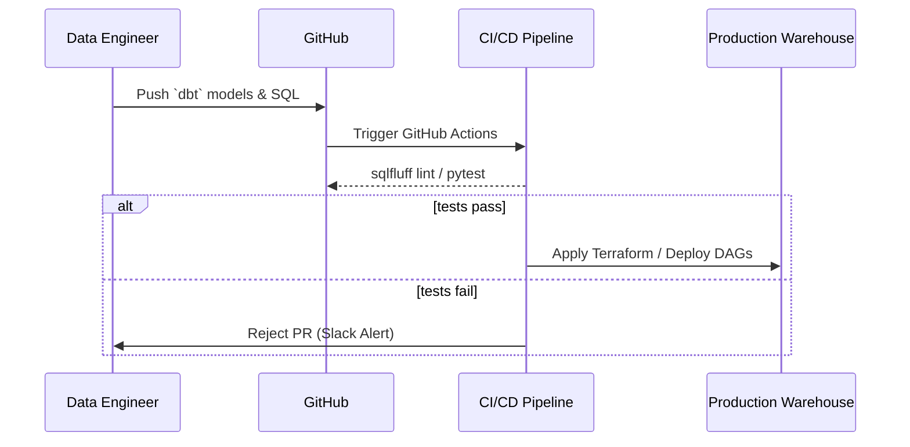

# 9. Observability & Testing

Software engineers test their code (Unit Tests, Integration Tests). 
Data engineers must test their code **AND their data**. 

!!! info "Historical Context: Data Downtime"
    In the 2010s, "Data Downtime" was devastating. The CEO would present a quarterly report to the Board of Directors, only for an intern to point out that the main graph had dropped to zero last Tuesday. The pipeline code had not broken; the third-party marketing API had quietly changed column `cost` from a float (`$12.50`) to a string (`"12.50 USD"`). Traditional software alerts (Datadog) never caught it because the Python script's HTTP response was still `200 OK`. The industry realized Data Quality required an entirely separate ecosystem.

---

## 9.1 Data Quality Checks (Testing Data)

A Data Engineer writes strict mathematical contracts the data must pass before it is allowed into the Warehouse.

1. **Volume Anomalies:** Did we suddenly receive 2 million rows today instead of the usual 50,000?
2. **Freshness:** Has this table been updated in the last 4 hours?
3. **Schema Drift:** Did the source system rename `user_id` to `customer_uid`?
4. **Distribution:** Is the `NULL` rate for the `email` column suddenly jumping from 2% to 45%?

**Internal Insight:** These checks are typically built directly into the ELT DAG. If the Airflow `Stripe` extraction pipeline finishes, the very next node in the graph is a `Great Expectations` or `dbt test` task. If the test fails, the Airflow pipeline is hard-stopped (Circuit Breaker), explicitly preventing the corrupted data from propagating to the downstream Tableau dashboards.

??? example "dbt Code: Data Quality Testing"
    In modern analytical pipelines, data tests are defined as simple YAML configurations. Dbt automatically compiles these into massive SQL queries that scan the tables for violations.
    ```yaml
    version: 2
    
    models:
      - name: stg_stripe__payments
        description: "Raw payment data extracted from Stripe API"
        columns:
          - name: payment_id
            tests:
              - unique              # Fails if there are exactly identical rows
              - not_null            # Fails if any row has an empty ID
    
          - name: payment_status
            tests:
              - accepted_values:    # Fails if an unexpected status code appears
                  values: ['success', 'failed', 'refunded']
                  
          - name: amount_usd
            tests:
              - dbt_expectations.expect_column_values_to_be_between:
                  min_value: 0      # You cannot have a negative payment
                  max_value: 100000 
    ```

---

## 9.2 The Three Pillars of Data Observability

While Data Testing asks *"Is this file correct?"*, Data Observability asks *"Why is my pipeline completely degraded?"* It is based on three foundational signals.

1. **Logs (The What):** Unstructured text strings emitted by Airflow/Spark (`[ERROR] Task failed: Timeout connecting to DB`). You index billions of log lines in Elasticsearch or Splunk.
2. **Metrics (The How Much):** Numeric time-series data (`cpu_usage = 85%, memory_spill = 4GB`). Scraped by tools like Prometheus and visualized in Grafana dashboards.
3. **Traces (The Where):** A single request (e.g., a massive backfill job) is assigned a Trace ID. As that job travels from Kafka to Spark to S3, it logs Span IDs. You can visually see exactly which server in the 100-server cluster took 40 minutes instead of 4 minutes. (Often implemented via OpenTelemetry).

### Hands-On Lab: Prometheus & Grafana
1. **Goal:** Export metrics from a Python ETL job.
2. **Implementation:** Use the Prometheus client library to expose runtime metrics, which are then scraped by Prometheus and displayed on a Grafana dashboard.

??? example "Python Code: Prometheus Metrics"
    ```python
    from prometheus_client import start_http_server, Counter, Summary
    import time

    # Create a metric to track time spent processing
    REQUEST_TIME = Summary('etl_processing_seconds', 'Time spent processing data')
    # Track number of records processed
    RECORDS_PROCESSED = Counter('etl_records_total', 'Total records processed')

    @REQUEST_TIME.time()
    def process_data():
        """A dummy function that takes some time."""
        time.sleep(1)
        RECORDS_PROCESSED.inc(100)

    if __name__ == '__main__':
        # Start up the server to expose the metrics.
        start_http_server(8000)
        # Generate some pipeline data
        while True:
            process_data()
    ```

---

## 9.3 DataOps and CI/CD

Data pipelines are now treated precisely like software. 
You do not edit `SELECT` statements directly in the Production Snowflake instance.
1. The Data Engineer creates a git branch feature (`fix-revenue-calc`).
2. They push code to GitHub.
3. GitHub Actions triggers a CI (Continuous Integration) pipeline.
4. The CI runner clones a tiny 1GB sample of Production Data into a temporary Testing Schema.
5. It runs the new transformation code, asserts the Data Quality tests, and deletes the schema.
6. Only if everything passes is the PR merged and deployed (CD) to Production.



### Hands-On Lab: Infrastructure-as-Code (Terraform)
1. **Goal:** Automate the provisioning of a cloud data cluster so that no engineer ever creates infrastructure manually via the console UI.
2. **Implementation:** Define an AWS EMR cluster as code using HashiCorp Terraform.

??? example "Terraform Code: Deploying AWS EMR"
    ```hcl
    resource "aws_emr_cluster" "data_cluster" {
      name          = "production-spark-cluster"
      release_label = "emr-6.10.0"
      applications  = ["Spark", "Hadoop", "Hive"]

      ec2_attributes {
        subnet_id                         = aws_subnet.main.id
        emr_managed_master_security_group = aws_security_group.allow_access.id
        emr_managed_slave_security_group  = aws_security_group.allow_access.id
        instance_profile                  = aws_iam_instance_profile.emr_profile.arn
      }

      master_instance_group {
        instance_type = "m5.xlarge"
      }

      core_instance_group {
        instance_type  = "m5.xlarge"
        instance_count = 3
      }
    }
    ```

---

!!! abstract "References & Foundational Reading"
    - **Great Expectations / dbt Documentation:** The modern bibles for declarative data testing.
    - **Site Reliability Engineering (SRE) Book** (Google). Chapters on Monitoring and Distributed Tracing are the foundation of modern observability.
