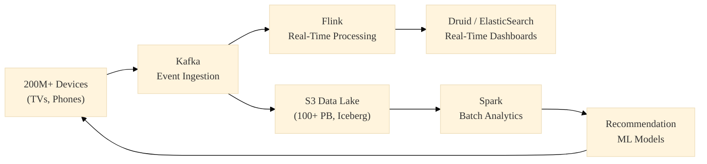

# 11. Real-World Case Studies

Learning the theory of distributed systems is one thing; seeing how hyperscale companies piece them together provides the actual engineering insight. Below are high-level blueprints of legendary industry architectures.

---

## 11.1 Netflix (The Evolution of High Availability)

!!! info "Historical Context: Chaos Engineering"
    Netflix was famously the first major company to migrate entirely to AWS (2008-2016). Recognizing that the cloud was inherently unreliable, they invented **Chaos Monkey**—a daemon that randomly terminated highly-active production EC2 servers during business hours to force software engineers to architect resilient, auto-healing systems.

### The Netflix Data Stack
Netflix runs one of the largest Data Lakes on the planet (approx. 100+ Petabytes) built entirely on **Amazon S3**.
- **Ingestion:** Millions of TVs emit billions of telemetry events globally. Netflix ingests these into **Apache Kafka**.
- **Event Streaming:** They use **Apache Flink** to process these streams in real-time (e.g., updating user recommendation models instantly based on what they just watched).
- **The Metadata Bottleneck:** Their Spark clusters were taking hours just to list the Parquet files in an S3 bucket before the query could even begin. To fix this, Netflix data engineers invented **Apache Iceberg**, which stores the metadata map in a highly compressed tree format, eliminating S3 `LIST` API calls entirely.

---

## 11.2 Uber (The Hudi Lakehouse)

Uber's infrastructure problem was fundamentally different from Netflix's. Uber relies on deeply transactional state changes (e.g., a trip goes from "Requested" $\to$ "Driver Assigned" $\to$ "En Route" $\to$ "Completed" $\to$ "Fare Adjusted"). 

### The Uber Data Stack
Uber was originally using massive Hadoop (HDFS) clusters. Doing a massive analytical `UPDATE` to correct a fare adjustment required rewriting terabytes of Parquet files every night.
- Uber engineers created **Apache Hudi** (Hadoop Upserts Deletes and Incrementals). 
- Hudi acts like a database layer on top of HDFS/S3. When Uber needed to update 5 rows of fare data in a 10TB table, Hudi didn't rewrite the Parquet files. It quickly appended the 5 rows to a highly-available **Avro** transaction log.
- During read time, the query engine (Apache Presto / Trino) mathematically merged the base Parquet file with the delta Avro log on-the-fly, giving analysts the most up-to-date reality without the horrific rewrite costs.

---

## 11.3 Snowflake (Separation of Compute and Storage)

!!! info "Historical Context: The Cloud Data Warehouse"
    Before 2012, if you used an on-premise Teradata warehouse and ran out of storage space, you literally had to purchase a server rack that contained *both* hard drives and CPUs. If you only needed the storage, the CPUs sat idle, wasting millions of dollars.

**Snowflake** fundamentally transformed the industry by completely divorcing Compute from Storage.
1. **The Storage:** Snowflake doesn't even own hard drives; it simply encrypts your data into its proprietary micro-partitions and stores it in your cheap Amazon S3 or Azure Blob container.
2. **The Compute:** When you run a query, Snowflake boots up standard, stateless EC2 Virtual Machines on AWS. 

**Internal Insight:** Because the VMs are entirely stateless, you can launch a "Medium Warehouse" (10 CPUs) for the Marketing team and an "X-Large Warehouse" (100 CPUs) for the Data Science team. They can both instantly query the *exact same* physical S3 data simultaneously without ever locking each other out or fighting for CPU resources. You pay for the storage by the Terabyte, and you pay for the Compute by the literal second, shutting down the VMs automatically when the query completes.

---

## 11.4 Anti-Patterns & Failure Modes

Decades of production incidents have created a well-known catalog of data engineering disasters. A distinguished engineer knows these by heart.

| Anti-Pattern | Description | Consequence | Fix |
|---|---|---|---|
| **The Data Swamp** | Dumping raw data into S3 with no schema, no metadata catalog, no documentation | Nobody can find or trust any dataset. The lake becomes useless. | Lakehouse (Iceberg/Delta) + Data Catalog (DataHub) |
| **The Small File Problem** | Streaming pipelines writing millions of tiny Parquet files (1KB each) to HDFS/S3 | HDFS NameNode runs out of memory tracking metadata. S3 LIST calls take hours. | Compaction jobs (Spark `repartition()`) to merge into 256MB files |
| **The Hot Shard** | Poor choice of partition key concentrates all traffic on one server | One node crashes; the other 99 sit idle | Consistent hashing, composite partition keys, salting |
| **The Zombie Pipeline** | An Airflow DAG that silently fails but reports "success" because error handling is absent | Downstream dashboards show stale/incorrect data for weeks | Circuit breakers, data quality checks (Great Expectations), alerting |
| **The Monolithic Batch Job** | A single 8-hour Spark job that processes everything end-to-end | One failure at hour 7 requires restarting from scratch | Break into idempotent micro-batches with checkpoint/savepoints |

---

## 11.5 Backup & Disaster Recovery

Production data engineering requires rigorous backup and disaster recovery (DR) planning. Two key metrics define DR strategy:

- **RPO (Recovery Point Objective):** How much data can you afford to lose? (e.g., "No more than 5 minutes of transactions.")
- **RTO (Recovery Time Objective):** How quickly must the system be operational? (e.g., "Within 15 minutes.")

### DR Strategies

| Strategy | RPO | RTO | Cost | Example |
|---|---|---|---|---|
| **Backup & Restore** | Hours | Hours | $ | Nightly `pg_dump` to S3 Glacier |
| **Pilot Light** | Minutes | 30min–1hr | $$ | Minimal replica in standby region, scaled up on failover |
| **Warm Standby** | Seconds | Minutes | $$$ | Active read replica in another AZ, promoted on failure |
| **Multi-Site Active-Active** | Near-zero | Near-zero | $$$$ | Spanner/CockroachDB multi-region with automatic failover |

### Key Techniques

- **Point-in-Time Recovery (PITR):** PostgreSQL and MySQL maintain Write-Ahead Logs (WAL). You can restore the database to any exact second in the past by replaying the WAL from a base snapshot.
- **S3 Versioning:** Every `PUT` object creates a new version. Accidental deletes are reversible. Combined with **Object Lock**, you create WORM (Write Once Read Many) compliance for financial data.
- **Immutable Backups:** Store backups in a separate AWS account with cross-account IAM policies. Even if the production account is compromised by ransomware, backups survive.

---

!!! abstract "References & Case Study Sources"
    - **Netflix Technology Blog:** *How Netflix microservices tackle dataset pub-sub* and *The Making of Apache Iceberg*.
    - **Uber Engineering Blog:** *Hudi: Uber Engineering's Data Processing Platform*.
    - **The Snowflake Architecture Paper:** *The Snowflake Elastic Data Warehouse* (Dageville et al., SIGMOD 2016).
    - **AWS Disaster Recovery Whitepaper:** The four DR strategies (Backup/Restore, Pilot Light, Warm Standby, Multi-Site).
