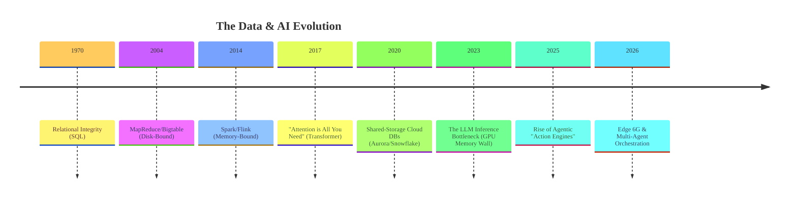

# Data Engineering: Fundamentals and Internals

This guide covers the ultimate spectrum of data architecture. It is split into two massive wings: The **Fundamentals Wing** (covering the basics of 2020-era Data Engineering) and the **Advanced 2026 Wing** (a distinguished engineer's treatise on Agentic AI, Deep Hardware Internals, and Planetary Scale).

---

## 🚀 The 2026 Architecture (Advanced Wing) 

Moving beyond basic tutorials to deconstruct mathematical foundations, internal source code, and hardware physics powering the next generation of **Agentic AI** systems.

### :material-brain: Part I: Fundamentals of 2026 Tech

-   :material-chip:{ .lg .middle } __01. Physics of AI Agents__
    :
    HBM memory walls, FLOPs vs Bandwidth.
    [:octicons-arrow-right-24: Read](advanced/01-physics-of-ai.md)

-   :material-vector-line:{ .lg .middle } __02. Vector DBs vs. SQL__
    :
    HNSW graph math, and FAISS C++ source.
    [:octicons-arrow-right-24: Read](advanced/02-vector-dbs-vs-sql.md)

-   :material-network-strength-4-alert:{ .lg .middle } __03. Edge Computing & 6G__
    :
    Decentralized inference, federated learning.
    [:octicons-arrow-right-24: Read](advanced/03-edge-computing-6g.md)

### :material-server-network: Part II: Distributed Systems Evolution

-   :material-database-sync:{ .lg .middle } __04. Shift to Shared-Storage__
    :
    Why Shared-Nothing died. Aurora and Neon.
    [:octicons-arrow-right-24: Read](advanced/04-shift-to-shared-storage.md)

-   :material-alert-decagram-outline:{ .lg .middle } __05. Consensus & Failure__
    :
    Raft/Paxos Math & Google Spanner TrueTime bounds.
    [:octicons-arrow-right-24: Read](advanced/05-consensus-and-failure.md)

### :material-robot-industrial: Part III: Agentic AI & Action Engines

-   :material-auto-fix:{ .lg .middle } __06. Rise of Agentic AI__
    :
    ReAct loop, tool-use sandboxes, and execution graphs.
    [:octicons-arrow-right-24: Read](advanced/06-rise-of-agentic-ai.md)

-   :material-account-group-outline:{ .lg .middle } __07. Multi-Agent Infrastructure__
    :
    Actor models, distributed tracing, and human-in-the-loop limiters.
    [:octicons-arrow-right-24: Read](advanced/07-multi-agent-infrastructure.md)

### :material-code-braces: Part IV: Deep Internals & Code

-   :material-apache-kafka:{ .lg .middle } __08. Kafka Internals__
    :
    OS `sendfile` memory math, bypassing JVM.
    [:octicons-arrow-right-24: Read](advanced/08-kafka-internals.md)

-   :material-fire:{ .lg .middle } __09. Spark Catalyst Optimizer__
    :
    ASTs, Tungsten Unsafe Memory, and Bytecode generation.
    [:octicons-arrow-right-24: Read](advanced/09-spark-catalyst.md)

-   :material-delta:{ .lg .middle } __10. Lakehouse Commit Logs__
    :
    Optimistic Concurrency Control math on S3.
    [:octicons-arrow-right-24: Read](advanced/10-lakehouse-commits.md)

### :material-domain: Part V: Unpacking the Titans

-   :material-head-lightbulb-outline:{ .lg .middle } __11. Deconstructing OpenAI__
    :
    3D Parallelism, InfiniBand Fat-Trees, Checkpointing.
    [:octicons-arrow-right-24: Read](advanced/11-deconstructing-openai.md)

-   :material-expansion-card-variant:{ .lg .middle } __12. Deconstructing Nvidia__
    :
    Tensor Cores, DGX SuperPODs, and the NCCL Ring.
    [:octicons-arrow-right-24: Read](advanced/12-deconstructing-nvidia.md)

-   :material-google-glass:{ .lg .middle } __13. Deconstructing Google__
    :
    TPUv6 pods, Optical Circuit Switches, and Pathway MoE.
    [:octicons-arrow-right-24: Read](advanced/13-deconstructing-google.md)

---

## 📚 The Fundamentals (Basics Wing)

New to Data Engineering? Start here. This covers the foundational history spanning Relational Databases, Hadoop architectures, and core ETL pipeline concepts.

-   :material-school:{ .lg .middle } __Part VI: Basic Engineering__
    :
    13 core chapters moving from ER models and SQL to HDFS, MapReduce, Architecture Patterns (Data Warehouse/Lakehouse), and Observability.
    [:octicons-arrow-right-24: Start Fundamentals Here](basics/01-data-fundamentals.md)

-   :material-wrench-cog-outline:{ .lg .middle } __Part VII: Basic Deep Dives__
    :
    Quick conceptual teardowns of the foundational technologies:
    [Kafka](basics/deep-dives/apache-kafka.md) | [Spark](basics/deep-dives/apache-spark.md) | [Flink](basics/deep-dives/apache-flink.md) | [Airflow](basics/deep-dives/apache-airflow.md) | [Cassandra](basics/deep-dives/cassandra.md) | [Delta Lake](basics/deep-dives/delta-lake.md)

